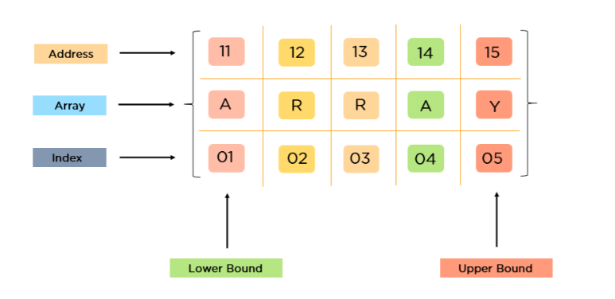
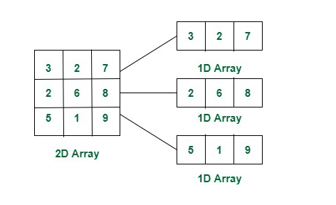
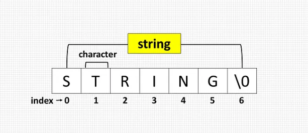

### Primitive vs Non-Primitive Types

| Feature    | Primitive Types                                                        | Non-Primitive Types                                           |
| ---------- | ---------------------------------------------------------------------- | ------------------------------------------------------------- |
| Definition | Basic data types that store single values                              | Complex data structures that store multiple values or objects |
| Data Types | `String`, `Number`, `Boolean`, `Null`, `Undefined`, `Symbol`, `BigInt` | `Object`, `Array`, `Function`, `Date`, `RegExp`               |
| Mutability | Immutable (cannot be changed)                                          | Mutable (can be modified)                                     |
| Stored in  | Stack memory                                                           | Heap memory                                                   |
| Example    | `let a = 10; let b = "Hello";`                                         | `let obj = {name: "John"}; let arr = [1, 2, 3];`              |

---

### Implicit vs Explicit Type Conversion

| Feature       | Implicit Type Conversion                 | Explicit Type Conversion                  |
| ------------- | ---------------------------------------- | ----------------------------------------- |
| Definition    | JavaScript automatically converts types  | Manually converting types using functions |
| Also Known As | Type Coercion                            | Type Casting                              |
| Example       | `"5" + 2 → `"52"` (String concatenation) | `Number("5") + 2 → 7`                     |
| Control       | Done automatically by JavaScript         | Done explicitly by the developer          |

---

### Pass by Value vs Pass by Reference

| Feature           | Pass by Value                                     | Pass by Reference                                                         |
| ----------------- | ------------------------------------------------- | ------------------------------------------------------------------------- |
| Definition        | A copy of the value is passed                     | A reference to the actual data is passed                                  |
| Affects Original? | No, changes do not affect the original value      | Yes, changes affect the original object                                   |
| Data Types        | Primitive types (`Number`, `String`, etc.)        | Non-primitive types (`Object`, `Array`, `Function`)                       |
| Example           | `let x = 10; let y = x; y = 20; // x is still 10` | `let obj1 = { a: 10 }; let obj2 = obj1; obj2.a = 20; // obj1.a is now 20` |

# Array

An **array** is a linear data structure used to store multiple elements.
It is a collection of elements of the same data type stored at contiguous memory locations.
 <br>

### Types of Arrays

1. Fixed Size Array
2. Dynamic Sized Array
3. 1-Dimensional Array
4. 2-Dimensional Array
   - A 2-dimensional array, known as a matrix, is arranged in rows and columns.
      <br>

### Initialization of Array

```js
let arr = [10, 20, 30];
let arr2 = ["c", "d", "e"];
let arr3 = [28.5, 36.5, 40.2];
let arr4 = [
  [1, 2, 3],
  [5, 6, 7],
  [9, 10, 11],
];
```

### Postfix (i++) vs. Prefix (++i) Increment

Both ++i and i++ increase a variable by 1, but they behave differently in expressions.

```js
i++; // Post-increment (returns value before incrementing)
++i; // Pre-increment (returns value after incrementing)
```

### Example

```js
let x = 5;
console.log(x++); // 5 (returns x, then increments)
console.log(x); // 6

let y = 5;
console.log(++y); // 6 (increments y, then returns)
console.log(y); // 6
```

### Difference Between `for` and `while` Loops

| Feature         | `for` Loop                                           | `while` Loop                                                                  |
| --------------- | ---------------------------------------------------- | ----------------------------------------------------------------------------- |
| Syntax          | `for(initialization; condition; update) { // code }` | `while(condition) { // code }`                                                |
| Use Case        | Best when the number of iterations is known          | Best when the number of iterations is unknown                                 |
| Initialization  | Declared within the loop header                      | Declared outside the loop                                                     |
| Condition Check | Checked before every iteration                       | Checked before every iteration, but requires external control for termination |

### Example:

#### `for` Loop Example:

```js
for (let i = 0; i < 5; i++) {
  console.log(i);
}
```

#### `while` Loop Example:

```js
let i = 0;
while (i < 5) {
  console.log(i);
  i++;
}
```

### Array Traversal

1. **Using a for loop**

```js
let arr = [1, 2, 3, 4, 5];
for (let i = 0; i < arr.length; i++) {
  console.log(arr[i]);
}
```

2. **Using forEach**

```js
arr.forEach((element) => console.log(element));
```

3. **Using for...of loop**

```js
for (let element of arr) {
  console.log(element);
}
```

### Difference Between for, for...of, and for...in Loops

| Loop Type  | Use Case                    | Works On                    | Iterates Over                                     | Best For                            |
| ---------- | --------------------------- | --------------------------- | ------------------------------------------------- | ----------------------------------- |
| `for`      | General-purpose loop        | Arrays, Strings             | Index-based iteration                             | When you need an index              |
| `for...of` | Iterating values            | Arrays, Strings, Maps, Sets | Values of iterable objects                        | When you only need values           |
| `for...in` | Iterating object properties | Objects (including Arrays)  | Keys (indexes for arrays, properties for objects) | When looping over object properties |

### Sum Formula Notes

1. The sum formula is used to calculate the total sum of a series.
2. General Formula:
   - Sum of first n natural numbers: **S = n(n+1)/2**
3. Example:
   - If n = 5, then S = 5(5+1)/2 = 15
4. This formula helps in quickly finding the sum without looping through numbers.

### Sum of Geometric Progression

Formula: **2^(n-1)**  
 This formula represents the sum of a geometric progression where each term is double the previous one.  
 Example: If n = 4, then  
 Sum = 2^(4-1) = 2^3 = 8

### Sum of Squares of First n Natural Numbers

Formula: **n(n+1)(2n+1)/6**  
 This formula calculates the sum of the squares of the first n natural numbers.  
 Example: If n = 3, then  
 Sum = 3(3+1)(2\*3+1)/6 = 3(4)(7)/6 = 14

# String

A **string** is a sequence of characters.<br>
 <br>

### Creation and Initialization

```js
let s = "Hello, World!";
```

### String Methods

- `length`: Returns the length of the string
- `toUpperCase()`: Converts string to uppercase
- `toLowerCase()`: Converts string to lowercase
- `slice()`: Extracts part of a string
- `replace()`: Replaces part of a string
- `split()`: Splits string into an array

Example:

```js
let str = "Hello, Sougata";
console.log(str.length); // 14
console.log(str.toUpperCase()); // "HELLO, SOUGATA"
console.log(str.slice(0, 5)); // "Hello"
```

# Object

An **object** is a collection of key-value pairs where each key is a property.

### Initialization

```js
let bio = {
  name: "Sam",
  address: "J.P.Nagar",
};
```

### Accessing Properties

```js
console.log(bio.name); // "Sam"
console.log(bio["address"]); // "J.P.Nagar"
```

### Object Methods

- `Object.keys()`: Returns an array of keys
- `Object.values()`: Returns an array of values
- `Object.entries()`: Returns an array of [key, value] pairs

Example:

```js
console.log(Object.keys(bio)); // ["name", "address"]
console.log(Object.values(bio)); // ["Sam", "J.P.Nagar"]
```

## Math Methods

### `Math.ceil()`

Rounds a number **UP** to the nearest integer.

```js
console.log(Math.ceil(0.6)); // 1
console.log(Math.ceil(1.2)); // 2
```

### `Math.floor()`

Rounds a number **DOWN** to the nearest integer.

```js
console.log(Math.floor(0.6)); // 0
console.log(Math.floor(1.2)); // 1
```

### `Math.abs()`

Returns the **absolute value** of a number.and convert Negative to Positive number

```js
console.log(Math.abs(1.2)); // 1.2
console.log(Math.abs(-1.2)); // 1.2
console.log(Math.abs(-10)); // 10
console.log(Math.abs(null)); // 0
```

## BigInt

**BigInt** values represent integers which are too high or too low.

```js
const a = BigInt(9007199254740991);
console.log(a); // 9007199254740991n
```

## Infinity

- `Number.POSITIVE_INFINITY`: Represents the largest positive value (Infinity)
- `Number.NEGATIVE_INFINITY`: Represents the smallest negative value (-Infinity)

```js
console.log(Number.POSITIVE_INFINITY); // Infinity
console.log(Number.NEGATIVE_INFINITY); // -Infinity
```

### isNaN()

Check if a Value is Not a Number

```js
console.log(isNaN(123)); // false
console.log(isNaN("123")); // false
console.log(isNaN("sam")); // true
```
