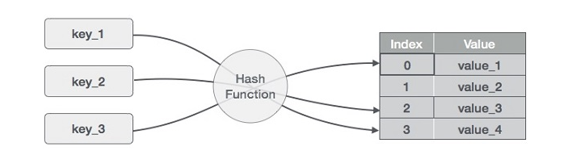
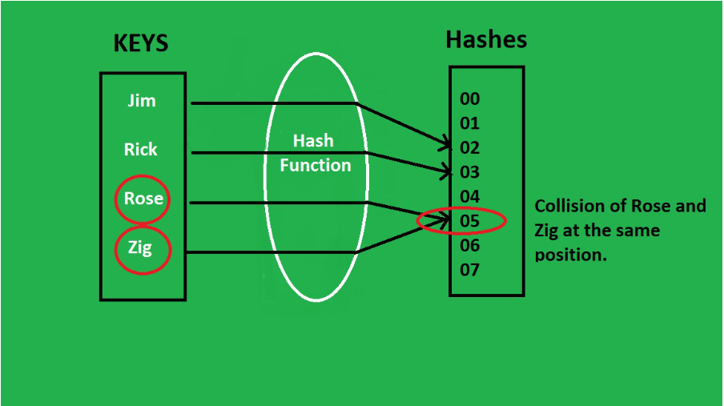
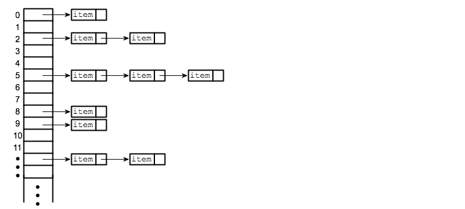

# Hashing

Hashing is a technique used in data structures that efficiently stores and retrieves data, allowing for quick access.

Hashing allows search, insert, and delete operations in O(1) time on average.

### Advantage

Fast Data Retrieval: Provides constant-time complexity (O(1)) for search operations in average cases.

Efficient Insertions and Deletions: Enables quick updates to data.

Flexible Data Size: Can dynamically handle varying amounts of data.

Handles Large Datasets Well: Efficiently manages large collections of data.

Direct Access Using Keys: Allows immediate access to data using unique keys.

### Internal Working of Hashing

 <br>
Hashing uses a hash function to convert keys into hash codes (index values).

These hash codes are then used to index the corresponding values in a hash table.

# Hash Map

A Hash Map is a common data structure used to store key-value pairs for efficient data retrieval.

### Important Points

> Keys may be duplicate, but values must be unique.

> Hash maps are unordered.

> Provides fast operations like search, insert, modify, and delete.

Methods
Insert Data

```
let mapObj = new Map();
mapObj.set("Sam", 21);
mapObj.set("Rik", 22);
mapObj.set("Lav", 23);
```

Fetch Value

```
console.log(mapObj.get("Sam")); // Output: 21
console.log(mapObj.get("John")); // Output: undefined
```

Modify Value

```
mapObj.set("Lav", 25);
console.log(mapObj.get("Lav")); // Output: 25
```

Search for a Key

```
console.log(mapObj.has("Sam")); // Output: true
console.log(mapObj.has("John")); // Output: false
```

Return All Keys

```
console.log([...mapObj.keys()]); // Output: [ 'Sam', 'Rik', 'Lav' ]
```

### implement hashmap

```
class HashMap {
    constructor() {
        this.store = [];
    }
    getHash(value) {
        value = value.toString();
        let sum = 0;
        for (var i = 0, len = value.length; i < len; i++) {
            sum += value.charCodeAt(i);
        }
        return sum;
    }
    set(key, value) {
        const hashValue = this.getHash(key);
        this.store[hashValue] = value;
    }
    get(key) {
        const hashValue = this.getHash(key);
        return this.store[hashValue];
    }
    isExist(key) {
        const hashValue = this.getHash(key);
        return this.store[hashValue] != null;
    }
    remove(key) {
        const hashValue = this.getHash(key);
        this.store[hashValue] = null;
    }
}
const map = new HashMap();
map.set(5, 100);
map.set(8, 200);
console.log(map.get(5));
console.log(map.get(8));
```

### HashMap vs HashTable.

| HashMap          | HashTable                |
| ---------------- | ------------------------ |
| Allows null keys | Does not allow null keys |
| Not synchronized | Synchronized             |
| Faster           | Slower                   |
| Unordered        | Ordered                  |

### Hash Function

For the same input, always gives the same output.

A perfect hash function always produces unique keys for unique inputs.

A non-perfect hash function might result in collisions (multiple inputs producing the same output).
Example:
k = 20 % 9 = 2

k = 29 % 9 = 2

k = 38 % 9 = 2

### Hashing Methods

1.  Modulo Method
    The index is calculated using the formula: H(k) = k % m
    7:1 → 7 % 9 = 7

11:2 → 11 % 9 = 2

20:9 → 20 % 9 = 2

23:5 → 23 % 9 = 5 2. Mid-Square Method
Square the key and select the middle digits.
Example:

H(16) = 16 \* 16 = 256

Take 25 or 56 as the hash index. 3. Multiplication Method
Uses a constant multiplication factor to calculate the hash index.
Formula: H(k) = floor(m _ (k _ A % 1)), where 0 < A < 1

### collision

In hashing, a collision(collision-hash function generate the same index for more than one key) occurs when two different keys produce the same hash code and are placed in the same bucket(indexed storage location for one or more entries can store multiple entries) in a hash table. To handle collisions, techniques like chaining (linked lists in buckets) or open addressing are used.
 <br>

### Collision Resolution Techniques

1. Chaining (Open Hashing)
   Store collided elements in a linked list at the same index.
    <br>

### Load Factor

Load Factor (λ): Measures how full the hash table is.
Formula: λ = n / m

n = Number of elements

m = Table capacity
When the load factor reaches a threshold (usually 0.75), the hash table is resized (doubled) to maintain performance.
