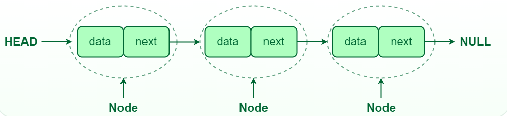
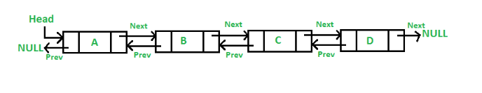

# Linked List

A linked list is a linear data structure where each element (called a node) contains two main parts:

`Data`: The value or information stored in the node.<br>
`Next` (in Singly Linked List) or Next and Prev (in Doubly Linked List): Pointers to the next node in the sequence (and previous node for doubly linked list).<br>

### list vs linked list

A list is a linear collection of elements stored in contiguous memory locations (e.g. an array).

A linked list is a linear data structure where elements (nodes) are connected via pointers, allowing dynamic memory allocation

### ArrayList vs LinkedList

| ArrayList                                                           | LinkedList                                                             |
| ------------------------------------------------------------------- | ---------------------------------------------------------------------- |
| ArrayList internally uses a dynamic array to store the elements.    | LinkedList internally uses a doubly linked list to store the elements. |
| Manipulation with ArrayList is slow.                                | Manipulation with LinkedList is faster.                                |
| ArrayList is better for storing and accessing data.                 | LinkedList is better for manipulating data.                            |
| The memory location for the elements of an ArrayList is contiguous. | The location for the elements of a LinkedList is not contiguous.       |

### Limitations of Arrays

#### Fixed Size:

The size of an array is fixed at the time of its creation.

#### Contiguous Memory Allocation:

Arrays store elements in contiguous memory locations, leading to inefficient insertions and deletions (since shifting elements is required).

#### Time Complexity:

Insert and delete operations are costly in terms of time complexity. Insertion or deletion at the beginning or in the middle of the array takes O(n) time.

#### Memory Wastage:

Arrays may also waste memory if allocated space is more than needed, or they may require resizing when they became full.

### Advantages of Linked Lists

Dynamic Size: Linked lists don’t have a fixed size, and memory is allocated dynamically as elements are added.
Efficient Insertions/Deletions: Insertions and deletions can be performed more efficiently in linked lists, especially at the beginning or middle of the list (without needing to shift other elements).

# Singly Linked List

In a singly linked list, each node contains:

`Data`: The value of the node.
`Next`: A pointer to the next node in the list (null for the last node).

<br>

```
class Node {
    constructor(data) {
        this.data = data;
        this.next = null;
    }
}


let a = new Node(2); // Create a node with data 2
let b = new Node(3);
let c = new Node(6);
a.next = b; // Link node 'a' to node 'b'
b.next = c; // Link node 'b' to node 'c'

let node = a; // Start from the head node
while (node != null) {
    console.log(node.data); // Output: 2 3 6
    node = node.next; // Move to the next node
}
```

# Doubly Linked List

In a doubly linked list, each node contains:

`Data`: The value of the node.<br>
`Next`: A pointer to the next node.<br>
`Prev`: A pointer to the previous node.<br>

<br>

```
class Node {
    constructor(data) {
        this.data = data;
        this.next = null;
        this.prev = null;
    }
}
function insertAtHead(head, x) {
    let newNode = new Node(x);
    if (head !== null) {
        newNode.next = head;
        head.prev = newNode;
    }
    head = newNode;
    return head;
}
function insertAtTail(head, x) {
    let newNode = new Node(x);
    if (head === null) {
        // If the list is empty, the new node becomes the head
        return newNode;
    }
    let temp = head;
    while (temp.next !== null) {
        temp = temp.next;
    }
    temp.next = newNode;
    newNode.prev = temp;
    return head;
}
function insertAtIndex(head, idx, x) {
    if (idx < 1) {
        console.error("Invalid index");
        return head;
    }
    let newNode = new Node(x);
    if (idx === 1) {
        return insertAtHead(head, x);
    }
    let temp = head;
    for (let i = 1; i < idx - 1; i++) {
        if (temp === null) {
            console.error("Index out of bounds");
            return head;
        }
        temp = temp.next;
    }
    if (temp === null) {
        console.error("Index out of bounds");
        return head;
    }
    let nextNode = temp.next;
    temp.next = newNode;
    newNode.prev = temp;
    newNode.next = nextNode;
    if (nextNode !== null) {
        nextNode.prev = newNode;
    }
    return head;
}
function deleteAtHead(head) {
    if (head === null) {
        console.error("List is empty, nothing to delete.");
        return null;
    }
    let temp = head;
    head = head.next; // Move head to the next node
    if (head !== null) {
        head.prev = null; // Update the new head's previous pointer
    }
    temp.next = null; // Detach the deleted node completely
    return head;
}
```
