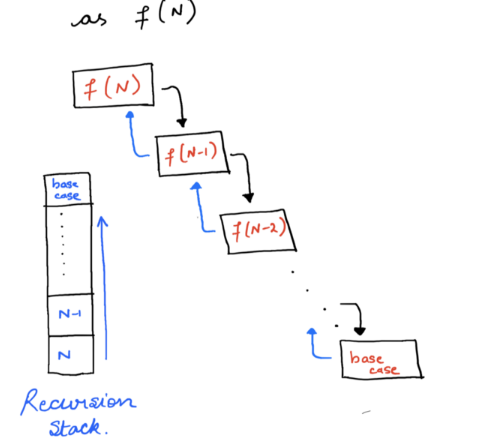
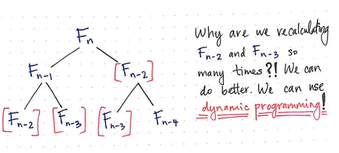
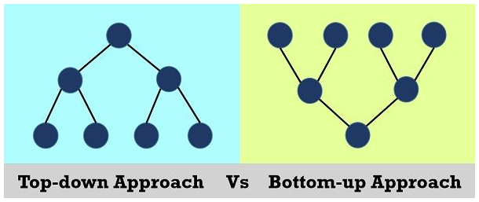

## Why is Recursion an Application of Stack?

Recursion is an application of stack because each recursive function call is stored in the call stack until it resolves, following a Last In First Out (LIFO) order.

## Difference between Recursion and Iteration

| S.No. | Recursion                                                              | Iteration                                                |
| ----- | ---------------------------------------------------------------------- | -------------------------------------------------------- |
| 1     | Recursion is a method where a function calls itself.                   | Iteration repeatedly executes a set of instructions.     |
| 2     | Requires a termination condition inside the recursive function.        | Requires a termination condition in the loop definition. |
| 3     | Code size is smaller.                                                  | Code size is larger compared to recursion.               |
| 4     | Slower in execution.                                                   | Faster compared to recursion.                            |
| 5     | Preferred when code simplicity is more important than time complexity. | Preferred when time complexity and performance matter.   |
| 6     | Has higher time complexity.                                            | Has lower time complexity.                               |
| 7     | Requires more memory (stack space).                                    | Requires less memory.                                    |

# Recursion

`when a function calls itself until a specific condition meet is called recursion`<br>
application of recursion and backtracking is render tree solving puzzle game
Recursive solutions work as a a basis for Dynamic Programming and Divide and Conquer algorithms

> its a approach that allows us to shorten our code it must have a base case and recursive case

```
methodName(n parameters){
if(haltCondition){
return result
}
return methodName(n parameters)
}
```

<br>
concept of Function Call Stack and stack Frame in recursive function

# Dynamic Programming

is mainly an optimization over plain recursion. Wherever we see a recursive solution that has repeated calls for the same inputs, we can optimize it using Dynamic Programming.
application of dp is optimize and memorize rendering,overlapping subproblem
problem related to choice mainly related to recursion and in recursion if there are overlapping problem and max/min related problem are there there use dynamic problem
<br>

### approaches:

Dynamic programming can be achieved using two approaches:

1. Top-Down Approach (Memoization)
   Top-Down breaks the large problem into multiple subproblems.
   if the subproblem solved already just reuse the answer. <br>
2. Bottom-Up Approach (Tabulation)
   Start computing result for the subproblem. Using the subproblem result solve another subproblem and finally solve the whole problem.
   

### Example

//find nth fibonacci number
`0 1 1 2 3 5`

```
function nthFibo(n){
if(n==0||n==1)return n
return nthFibo(n-1)+nthFibo(n-2)
}
```

//print 1st n natural number

```
function print(c,n){
if(c===n)return
else {
console.log('sam',c)
print(c+1,n)
}
}
print(1,5)
```

//print sum of 1st n natural number

```
function print(c,n,s){
if(c===n){
console.log(s)
return}
else {
s+=c
print(c+1,n,s)
}
}
print(1,5,0)
```

//print sum of 1st n natural number with alternate signs
1-2+3-4+5=3

```
function seriesSum(n){
if(n===0)return 0
if(n%2===0) return seriesSum(n-1)-n
else return seriesSum(n-1)+n
}
```

//find gcd of two number

```
function gcd(x,y){
if(y==0)return x;
return gcd(y,x%y)
}
```

//find sum of digit using recursion

```
function sod(n){
if(n>=0&&n<=9){
return n
}
return sod(n/10)+n%10
}
```

//factorial of n
logic: n!=n (n-1) (n-2)...1 =>fact(5)=5\*fact(4)

```
function fact(n){
if(n===0)return BigInt(1)
else return BigInt(n) * fact(n-1)
}
console.log(fact(5).toString())
```

//Power Of Numbers Pow(x, n)
//logic n^p=5^3=5\*pow(5,2)

```
var myPow = function (x, n) {
if (x === 0) return 0;//0^0=0
if (n === 0) return 1//0^1=1
if (n === 1) return x
//make negative power positive
if (n < 0) {
x = 1 / x
n = -n
}

    if (n % 2 !== 0) return x * myPow(x, n - 1)

    return myPow(x * x, n / 2)

};
```

//print array value recursively and find max number

```
function printArray(arr,i){
if(i===arr.length)return
console.log(arr[i])
let small=printArray(arr,i+1)
return Math.max(arr[i],small)
}
```

//sum of array elements

```
function sum(arr,i){
if(i===0)return 0
return arr[i-1]+sum(arr,i-1)

}
const arr=[1,2,3,4,5]
const res=sum(arr,arr.length-1)
console.log(res)
```

//largest element in array

```
function largest(arr,i){
if(i===1)return arr[0]
return Math.max(largest(arr,i-1),arr[i-1])
}
const arr=[1,2,3,4,5]
const res=largest(arr,arr.length)
console.log(res)
```

//reverse an array

```
function swap(arr,i,j){
const temp = arr[i];
arr[i] = arr[j];
arr[j] = temp;
}
function reverseArr(l,r,arr){
if(l>=r)return
swap(arr,l,r)
reverseArr(l+1,r-1,arr)

}
const arr=[1,2,3,4,5]
reverseArr(0,arr.length-1,arr)
console.log(arr)
```

//find linear search using recursion

```
function search(arr,n,target,i){
if(i>=n) return false
if(arr[i]===target) return true
return search(arr,n,target,i+1)
}
```

//remove all the occurence of a from the string "abcax"<br>
//f(s,5)->'',f(s,4)=>'x',f(s,3)=>"cx",f(s,2)=>"cx",f(s,1)=>bcx,f(s,0) return bcx

```
function removeA(s,i){
if(i==s.length) return '';
let small=removeA(s,i+1)
let curr=s.charAt(i);
if(curr!=='a') return curr+small
}
```
