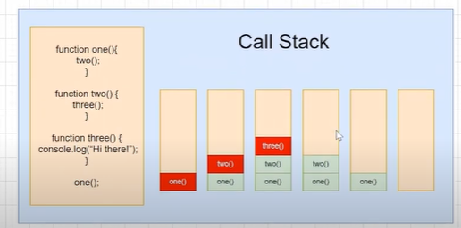
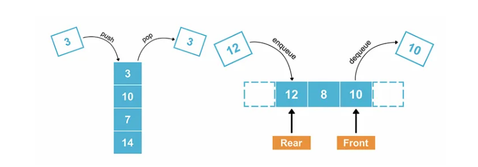

# call stack

The call stack is a data structure that keeps track of function calls in JavaScript, following the LIFO (Last In, First Out) principle. When a function is invoked, it gets pushed onto the stack, and when it finishes execution, it gets popped off.
 <br>

```js
function one() {
  console.log("one");
  second();
}
function two() {
  console.log("two");
  third();
}
function three() {
  console.log("three");
}
one();
```

```js
one;
two;
three;
```

# Abstract Data Type (ADT)

An Abstract Data Type (ADT) is a data structure that is defined by its behavior (operations) rather than its implementation.

### Common ADTs

1. List
2. Stack
3. Queue
4. Deque
5. Map
6. Set

## FIFO vs LIFO in JavaScript

| Feature             | FIFO (First-In-First-Out)                        | LIFO (Last-In-First-Out)                              |
| ------------------- | ------------------------------------------------ | ----------------------------------------------------- |
| **Definition**      | Elements are processed in the order they arrive. | Elements are processed in reverse order of arrival.   |
| **Insertion**       | New elements are added at the back.              | New elements are added on top.                        |
| **Removal**         | Oldest element is removed first.                 | Newest element is removed first.                      |
| **Usage**           | Used in OS scheduling, networking, etc.          | Used in undo/redo operations, function calls (stack). |
| **Time Complexity** | O(1) for insertion and removal.                  | O(1) for insertion and removal.                       |
| **Data Structure**  | Implemented using Queue.                         | Implemented using Stack.                              |

# Stack:

A stack is an ordered list that follows the LIFO (Last In, First Out) principle. Elements can only be inserted and deleted from one end, called the top of the stack. It uses variable size allocation.

> example
> Reverse a string or list
> Checking balanced parentheses
> Finding the next greater element
> Solving the Tower of Hanoi problem
> Sorting a stack

 <br>

### key operation:

#### push():

adds an element to the top of the stack

#### Pop():

removes and returns the top elements

#### peek/Top():

return the top element without removing it

#### isEmpty():

check if stack is empty

#### isFull():

check if stack is full

#### overflow:

if stack is full and you try to push an element

#### underflow:

if stack is empty and you try to pop an element

#### Prefix expression:

operand are follow operator

#### Postfix expression:

Operator are follow operands

### //convert Infix expression to postfix expression

`A+(B-C)\*D^E/F`

A - A Operand A is directly added to the postfix.

- - A Operator + is pushed onto the stack.
    ( + ( A Left parenthesis ( is pushed onto the stack.
    B + ( A B Operand B is added to the postfix.

* - (- A B Operator - is pushed onto the stack.
    C + (- A B C Operand C is added to the postfix.
    ) + A B C - Pop stack until (; append popped operators.

- - - A B C - Operator _ is pushed onto the stack.
      D + _ A B C - D Operand D is added to the postfix.

### //convert Infix expression to prefixfix expression

D / ^ F E D Operand D is added to the postfix.

- - F E D ^ Pop ^ (higher precedence); push _.
    ( _ ( F E D ^ Left parenthesis ( is pushed onto the stack.
    C \* ( F E D ^ C Operand C is added to the postfix.

* - (- F E D ^ C Operator - is pushed onto the stack.
    B _ (- F E D ^ C B Operand B is added to the postfix.
    ) _ F E D ^ C B - Pop until (; append popped operators.

- - F E D ^ C B - _ Pop _ (higher precedence); push +.
    A + F E D ^ C B - \* A Operand A is added to the postfix.

### Implementation:

```
let stack = [];
let top = -1;
const N = 10; // Maximum size of the stack

function push(x) {
if (top === N - 1) {
console.log('Stack Overflow');
} else {
stack[++top] = x;
}
}

function pop() {
if (top === -1) {
console.log('Stack Underflow');
return null;
} else {
return stack[top--];
}
}

function peek() {
if (top === -1) {
console.log('Stack is empty');
return null;
} else {
return stack[top];
}
}

function isEmpty() {
return top === -1;
}

// Example usage
push(10);
push(20);
console.log(peek()); // 20
console.log(pop()); // 20
console.log(isEmpty()); // false
```

# Queue:

A queue is an ordered list that follows the FIFO (First In, First Out) principle. Elements are inserted at one end (rear) and removed from the other end (front).

> example
> ticket booking line,print queue
> application of queue:
> handleing request in a server
> scheduling in os
> managing share resource

### key operation

enqueue
dequeue
peek
size
isEmpty

### Key Operations of a Queue:

enqueue(x): Adds an element to the rear of the queue.
dequeue(): Removes and returns the element at the front of the queue.
peek(): Returns the element at the front without removing it.
isEmpty(): Checks if the queue is empty.
size(): Returns the number of elements in the queue.

### Implementation:

```
const N = 5;
let queue = new Array(N);
let front = -1, rear = -1; // f,r [][][]

function enqueue(x) {
if (rear === N - 1) {
console.log('Queue Overflow');
} else if (front === -1 && rear === -1) {
front = rear = 0; // [f,r][][]
queue[rear] = x;
} else {
//increase the rear and add the value
queue[++rear] = x; // [f][][r]
}
}

function dequeue() {
if (front === -1 && rear === -1) {
console.log('Queue Underflow');
return null;
} else if (front === rear) {
let item = queue[front];
front = rear = -1;
return item;
} else {
//return value and increase front
return queue[front++];
}
}

function displayQueue() {
if (front === -1 && rear === -1) {
console.log('Queue is empty');
} else {
console.log(queue.slice(front, rear + 1));
}
}

// Example usage
enqueue(10);
enqueue(20);
enqueue(30);
console.log(dequeue()); // 10
displayQueue(); // [20, 30]
```

# Priority Queue

A Priority Queue is a type of queue where each element is associated with a priority, and elements are served based on their priority rather than their insertion order.

### Types

Max Priority Queue → Higher priority elements are served first.<br>

Min Priority Queue → Lower priority elements are served first.

### Operations

insert(element, priority) → Insert an element with its priority.<br>

getHighestPriority() → Return the element with the highest priority without removing it.<br>

deleteHighestPriority() → Remove and return the element with the highest priority.<br>

isEmpty() → Check if the queue is empty.<br>

### Out of Memory (OOM) error

An Out of Memory (OOM) error in JavaScript occurs when the application tries to allocate more memory than is available, leading to crashes or unresponsive behavior. This often happens due to memory leaks or excessive data processing

```js
let arr = [];
while (true) {
  arr.push(new Array(1000000).fill("*"));
}
```

to prevent that Process large datasets in chunks instead of loading everything at once.
If running a Node.js application, you can increase the V8 heap size using: node --max-old-space-size=4096 script.js

### empty stack exception error

In JavaScript, an "Empty Stack Exception" is not a built-in error like in languages such as Java. However, it typically refers to an attempt to pop or peek from an empty stack, which may return undefined or cause unintended behavior.

```js
let stack = [];
console.log(stack.pop()); // undefined (no error, but stack is empty)
console.log(stack[stack.length - 1]);
```

To handle this, always check if the stack is empty before accessing elements

```js
if (stack.length === 0) {
  console.error("Stack is empty!");
}
```
