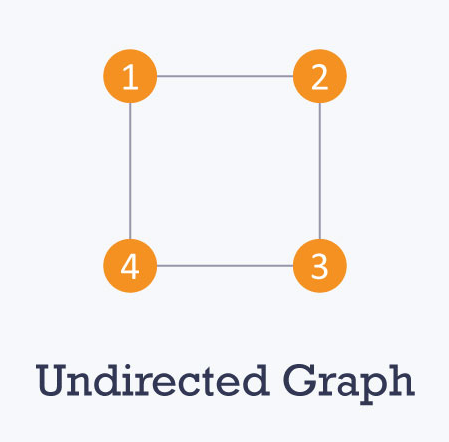
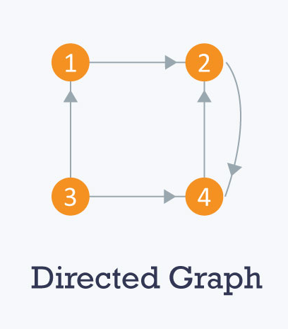
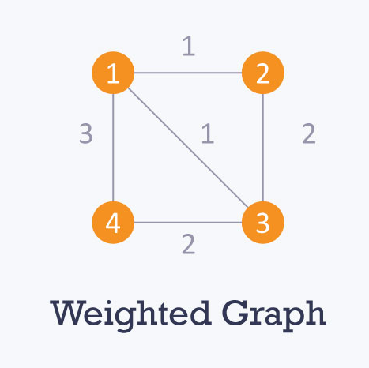
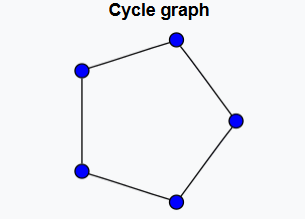
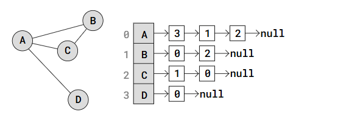
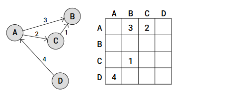

# Graph

A graph is a data structure consisting of vertices (nodes) and edges (connections). It is commonly used to represent networks like social connections, maps, and web pages.

Types of Graphs 
1)undirected graph 
  
The edges have no direction.
a-b 
2)directed Graph (digraph): 
  
The edges have a direction.
a->b 
3)weighted graph 
  
The edges have weights (costs).
4
a->b 
4)cyclic graph 
  
A graph that contains at least one cycle.
a->b->c->d->a 
5)acyclic Graph:
A graph with no cycles.
a → b → c → d. 
6)connected Graph
every vertex is reachable from any other vertex. 
7)disconnected Graph
some vertices are not reachable from others

graph properties
degree of graph: The degree of a vertex is the number of edges connected to it.
indegree:Number of edges coming into a vertex (only for directed graphs)
outdegree:Number of edges going out from a vertex (only for directed graphs)

#Graph Representation 
#adjacency list: 
  
Each node stores a list of its adjacent nodes.its kind a list of lists
Space Complexity: O(V + E),V=total list of vertex and E=number of edges(1,2,3)
1 → [2, 3]
2 → [1, 3]
3 → [1, 2]

#adjacency matrix(n\*n): 
  
here 1 connected with 2 and 2 connected with 3 and 3 to 1
A matrix where a[i][j] = 1 if there is an edge between i and j, otherwise 0
Space Complexity: O(n²).
1 2 3
1 0 1 1
2 1 0 1
3 1 1 0

graph traversal
1)Breadth-First Search (BFS)
Uses: Finds the shortest path in an unweighted graph.
Implementation: Uses a queue (FIFO).
Steps:
Start from a node and mark it as visited.
Visit all its neighbors before going deeper.
Continue until all nodes are visited.

2. Depth-First Search (DFS)
   Uses: Detects cycles, finds connected components.
   Implementation: Uses a stack (LIFO) or recursion.
   Steps:
   Start from a node and mark it as visited.
   Visit the first unvisited neighbor recursively.
   Backtrack if no unvisited neighbor is found.

spanning tree
in a spaning tree in a graph all the vertices are same as given graph but number of vertices is 1 edge less
spaning tree can not have a cycle and does not disconnected
adding one edge to the spanning tree will create a loop
every connected and undirected graph has atleast one spaning tree

minimum spanning tree
A Minimum Spanning Tree (MST) is a spanning tree where the sum of edge weights is minimized.
1)Prim's Algorithm (Greedy Approach)
Start from any node.
Pick the smallest weighted edge that connects to an unvisited node.
Repeat until all nodes are connected.
2)Kruskal's Algorithm (Greedy + Sorting)
Sort all edges by weight.
Pick the smallest edge that doesn’t create a cycle.
Repeat until all nodes are connected.

detect cycle in directed graph
Approach: Use DFS with a visited array.
start every node indicate as -1 it mean unvisited
0 means visited and in a stack
1 means visited and pop out from stack,completely processed

detect cycle in undirected graph
Approach: Use DFS with parent tracking.

Topological sort
Used for: Ordering tasks with dependencies (e.g., course scheduling).
graph should be directed and acyclic graph,if its there then we have atleast one topological ordering
find in-degree of the graph and start with node having 0 in-degree,remove edges and update in-degree,update untill node are processed

Find the shortest path (Dijkstra's Algorithm)
Used for: Finding the shortest path in a graph with non-negative weights.
Set all distances to infinity, except the start node (0)
Use a priority queue to pick the smallest distance node.
Update the distances of its neighbors.
Repeat until all nodes are processed.

Find the shortest path (Bellman Ford algo):
dijkstra algo can not work having negative weight so Bellman ford algo works
Used for: Graphs with negative weights.
Initialize all distances to infinity.
Relax all edges V-1 times
If any distance updates in the V-th iteration, a negative cycle exists.
