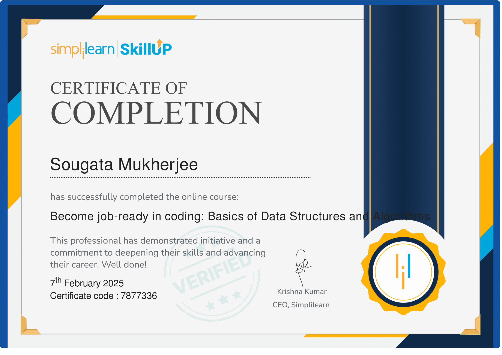
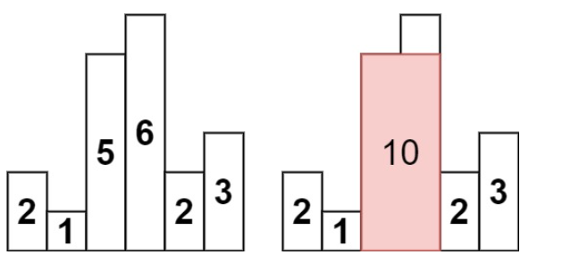

# Achievement

{ width=400 height=250 }<br>

# Array & String

//Q1 in integer array move all 0's to the end of the array<br>
input: arr=[1,2,0,2,1,0]
output:arr=[1,2,2,1,0,0]<br>
//Q2 remove duplicate from sorted integer array<br>
input: arr=[1,2,0,2,1,0]
output:arr=[1,2,0]<br>
//Q3 rotate the array in k steps<br>
input: arr=[1,2,0,2,1,0],k=3
output:arr=[2,1,0,1,2,0]<br>
//Q4 find the missing number in an array<br>
input: arr=[0,1,2,3,5]
output:[4]<br>
//Q5 swap first and last character of a string or an array<br>
input: str="Test" arr=[5,17,11,10,12,6]
output:"tesT" or [6,17,11,10,12,5]<br>
//Q6 find the second(k) largest element in an array<br>
input: arr=[0,1,2,3,5]
output:[3]<br>
//Q7 reverse a string without affecting special character<br>
input: str='a,b$c'
output:'c,b$a'<br>
//Q8 reverse a number<br>
input: num=05 or -213
output:5 or -312<br>
//Q9 reverse each word in a sentence<br>
input: str='hello world'
output:'dlrow olleh'<br>
//Q10 find a triplet that sum to a given value in an array or 3 sum or sum od zeros<br>
input: arr=[-1,0,1,2,-1,-4],target=0
output:[-1,0,1] and [-1,-1,2]<br>
//Q11 find the number of occurrence in an array<br>
input: arr=[1,2,3,3,4,5,5],item=3
output:2<br>
//Q12 find the square of a sorted array<br>
input: arr=[1,3,-5,-6]
output:[1,9,25,36]<br>
//Q13 find first unique character in a string<br>
input: str='leetcode' or 'mymy'
output:0 or -1<br>
//Q14 find the product of a sorted array except self<br>
input: arr=[1,2,3,4]
output:[2*3*4,1*3*4,1*2*4,1*2*3]<br>
//Q15 check string is Anagram or not<br>
input: str1='listen' str2='silent'
output:yes<br>
//Q16 find middle value<br>
input: a=10,b=12,c=15
output:12<br>
//Q17 shuffle an array elements like [x1,y1,x2,y2,...xn,yn]<br>
input: arr=[2,5,1,3,4,7]
output:[2,3,5,4,1,7]<br>
//Q18 find common element from 3 sorted array<br>
input: a=[1,2,3,4,6],b=[1,2,3],c=[2,3,5,8]
output:[2,3]<br>
//Q19 find majority elements in an array<br>
input: arr=[1,2,2,6,6,6,6,7,10]
output:[6]<br>
//Q20 reverse 1st half of the elements in an array<br>
input: arr=[5,7,11,10,12,6]
output:[11,7,5,10,12,6]<br>
//Q21 check two array are equal or not<br>
input: arr1=[1,2,3] arr2=[1,2,3]
output:true<br>
//Q22 minimum number of swap required to sort the array<br>
input: arr=[4,3,2,1]
output:2<br>
//Q23 dividing a string in n equals part<br>
input: str='aaabbbccc',equalPart=3
output:abc<br>
//Q24 find longest common subpath<br>
input: str1='testing',str2='test'
output:test<br>
//Q25 check number is perfect square or not<br>
input: num=36,100
//Q26 square root of a number<br>
Input: n = 4 Output: 2
output:yes<br>
//Q26 how many capital and small letter in a string<br>
input: str='AbbaBaa12'
output:2 5<br>
//Q27 check weather a triangle is valid or not<br>
input: a1=9,a2=40,a3=41
output:valid 180<br>
//Q28 check weather a year is leap year or not<br>
input: year=2024
output:leap year<br>
//Q29 check weather a number is prime number or not<br>
input: n=7
output:prime<br>
//Q30 print all prime number between 1 to 10<br>
input: 1-10
output:prime<br>
//Q31 check whether number or string is palindrome or not (1,121,1221)<br>
//Q32 print fibonacci sequence f(n)=f(n-1)+f(n-2) where f(0)=0,f(1)=1<br>
//Q33 create a program related climbing stairs<br>
input: n = 3 output:3<br>
//Q34 check whether number is armstrong number or not<br>
1634=>1^4+6^4+3^4+4^4=1634<br>
//Q35 find HCF/GCD(Highest common factor) and LCM(Least common multiple)<br>
Input: a = 12, b = 18 output:hcf=6,lcm=36<br>
//Q36 check weather number is perfect or not<br>
6=>1+2+3,28=>1+2+4+7+14<br>
//Q37 find the longest common prefix among all the strings.<br>
example club,clao,clove=>cl<br>
//Q38 count number of vowels in a string<br>
//Q39 The task is to compute the average salary of the employees, excluding the minimum and maximum salary values<br>
//Q40 write a function to rotate the matrix by 90 degrees clockwise.<br>
//Q41 wap to check if the matrix is a lower triangular matrix<br>
input const matrix = [
[1, 0, 0],
[4, 5, 0],
[7, 8, 9]
];
output:true<br>
//Q42 find the maximum area of water a container can store<br>
Input: [4, 3, 2, 1, 4]
output:16<br>
//Q43 check balanced parentheses<br>
//Q44 Star Pattern 1<br>

```
<!-- *
     ***
     ***** -->

//Q45 Star Pattern 2<br>

<!-- *****
     *   *
     *   *
     *   *
     ***** -->

//Q46 Star Pattern 3<br>

<!-- 4
     43
     432
     4321 -->

//Q47 Star Pattern 4<br>

<!-- 1
    123
   12345 -->

//Q48 Star Pattern 5<br>

<!-- *****
      ***
       * -->

//Q49 Star Pattern 6<br>

<!--   *
      **
     ***
      **
       *-->

//Q50 Star Pattern 7<br>

<!-- 1   1
     12 22
     12333 -->
```

//Q51 extract multiple whitespace from string<br>
//Q52 longest substring without repeating characters<br>
"abcabcbb" and "bbbb" ans is "abc" and "b"<br>
//Q53 find the maximum sum of the contiguous subarray.<br>
Input: [1, -2, 3, 4, -1, 2, 1, -5, 4]
output:10 [3, 4, -1, 2, 1]<br>
//Q54 find the sum of all numbers divisible by 2 and 3<br>
//Q55 implement merge sort<br>
input: [4, 2, 7, 1, 9, 3] output:[1, 2, 3, 4, 7, 9]<br>
//Q56 implement quick sort<br>
input:[3, 6, 8, 10, 1, 2, 1] output:[1, 1, 2, 3, 6, 8, 10]<br>
//Q57 flatten a nested array<br>
input: arr = [1, [2, [3, 4], 5], 6] output: [1, 2, 3, 4, 5, 6]<br>
//Q58 convert an array of objects to a single object:<br>
input: arr = [{id: 1, value: 10}, {id: 2, value: 20}, {id: 3, value: 30}]
output: {1: 10, 2: 20, 3: 30}<br>
/Q59 write a function to find all keys in an object with a specific value.<br>
input: obj = {a: 1, b: 2, c: 1}, value = 1
output: ['a', 'c']<br>
//Q60 merge two objects:<br>
input: obj1 = {a: 1, b: 2}, obj2 = {b: 3, c: 4}
output: {a: 1, b: 3, c: 4}<br>
//Q61 convert an object to an array of key-value pairs:<br>
input: obj = {a: 1, b: 2, c: 3} output: [['a', 1], ['b', 2], ['c', 3]]<br>
//Q62 find the intersection of two arrays:<br>
input: arr1 = [1, 2, 2, 1], arr2 = [2, 2] output: [2, 2]<br>
//Q63 update nested object property<br>
//Q64 remove Properties from an Object<br>
//Q65 check if Two Objects are Equal<br>
//Q66 check if Object is Empty<br>
//Q67 count Properties in an Object<br>
//Q68 basic understanding of curring and closure<br>
//Q69 create a utils functions of debouncing<br>
//Q70 create a utils functions of throttling<br>
//Q71 create a memorize functions<br>
//Q72 basic understanding of for of loop<br>
//Q73 create a polyfills of map method and forEach method<br>
//Q74 create a polyfills of filter method<br>
//Q75 Find the shortest string in array<br>
Input:['aaaa', 'aaaaaa', 'aaaaaaaa', 'aaa'] output 'aaa'<br>
//Q76 swap two number with or without using third variable<br>
Input: a=10,b=20 Output: a=20,b=10<br>
//Q77 create a simple breadcrumb using an array of object<br>
//Q78 Check If Two String Arrays are Equivalent <br>Input: word1 = ["ab", "c"], word2 = ["a", "bc"] Output: true "ab" + "c" === "a" + "bc" === "abc"<br>
//Q79 Rectangle Overlap<br>
Input: rec1 = [0,0,2,2], rec2 = [1,1,3,3] Output: true<br>
//Q80 Water and Jug Problem<br>
Input: x = 3, y = 5, target = 4 Output: true<br>
//Q81 find unique paths in a 2d grid<br>
Input: m = 3, n = 7 Output: 28<br>
//Q82 maximum amount of money you can rob from a row of houses, represented by an integer array nums, without robbing two adjacent houses<br>
Input: nums = [1,2,3,1] so output is 1+3=4<br>
//Q83 finding all possible paths in a 2D grid or rat in a maze(in 4 direction)<br>
//Q84 Sum of Array Elements and find max<br>
//Q85 reverse an array<br>
//Q86 Transpose of a Matrix<br>
//Q87 remove all even numbers<br>
//Q88 Convert UPPERCASE to lowercase<br>
//Q89 check rotated and sorted<br>
Input: nums = [3,4,5,1,2]
Output: true<br>
//Q90 binary to decimal<br>
//Q91 decimal to binary<br>
//Q92 Fahrenheit to Celsius<br>

# tree

//Q93 Check if a tree is a BST or BT<br>
//Q94 find the lowest common ancestor (LCA) of two given nodes in the tree.<br>
//Q95 Level Order Traversal of Binary Tree<br>
//Q96 Preorder traversal in binary tree<br>
//Q97 Right/Left side View of Binary Tree<br>
//Q98 Merge Two Binary Trees<br>
Input: root1 = [1,3,2,5], root2 = [2,1,3,null,4,null,7]
Output: [3,4,5,5,4,null,7]<br>
//Q99 Sum of Left Leaves<br>
Input: root = [3,9,20,null,null,15,7]
Output: 9+15=24<br>
//Q100 Maximum or Minimum Depth in Binary Tree<br>
//Q101 check a tree is Balanced Binary Tree or AVL tree<br>
//Q102 Given the root of a binary tree, check whether it is a mirror(symmetric) of itself<br>
Input: root = [1,2,2,3,4,4,3] Output: true<br>
//Q103 Check it two trees are Identical(have the same value) or Not <br>
//Q104 Subtree of Another Tree<br>
//Q105 Count total Nodes in a complete Binary Tree<br>
//Q106 Invert/Flip Binary Tree<br>
Input: root = [4,2,7,1,3,6,9]
Output: [4,7,2,9,6,3,1]<br>
//Q107 whether a binary tree is a full binary tree or not<br>
//Q108 Recover BST <br>
Input: root = [1,3,null,null,2]
Output: [3,1,null,null,2]<br>
//Q109 Zig-Zag Level Order Traversal <br>
Input: root = [3,9,20,null,null,15,7]
Output: [[3],[20,9],[15,7]]<br>
<br>

# two pointer

//Q110 Given two strings s and t, return true if s is a subsequence of t, or false otherwise.<br>
Input: s = "abc", t = "ahbgdc"
Output: true<br>
//Q111 Remove Duplicates from Sorted Array<br>
Input: nums = [1,1,2]
Output: 2, nums = [1,2,_]<br>
//Q112 trapping rain water<br>
Input: height = [0,1,0,2,1,0,1,3,2,1,2,1]
Output: 6<br>
//Q113 Container With Most Water<br>
Input: height = [1,8,6,2,5,4,8,3,7]
Output: 49<br>
//Q114 Largest Rectangle in Histogram  
Input: heights = [2,1,5,6,2,3]
Output: 10<br>
<br>
//Q115 count the number of positive triangle<br>
Input: arr[] = [4, 6, 3, 7]
Output: 3<br>
//Q116 Segregate 0s and 1s in an array or move all even integer followed by all odd integer<br>
Input : [0, 1, 0, 1, 0, 0, 1, 1, 1, 0]
Output : [0, 0, 0, 0, 0, 1, 1, 1, 1, 1]<br>

# prefix sum

//Q117 print the sum of value in a array in given range(l=3 an r=5 follow 1 based index)<br>
a=[2,4,1,3,6,5]=1+3+6
1 2 3 4 5 6<br>
//Q118 subarray sum equals k<br>
Input: nums = [1,1,1], k = 2
Output: 2<br>
//Q119 subarry sum divisible by k<br>
Input: nums = [4,5,0,-2,-3,1], k = 5
Output: 7<br>
//Q120 Maximum Average Subarray<br> Input: nums = [1,12,-5,-6,50,3], k = 4
Output: 12.75000
Explanation: Maximum average is (12 - 5 - 6 + 50) / 4 = 51 / 4 = 12.75<br>
//Q121 find Maximum Subarray<br>
Input: nums = [-2,1,-3,4,-1,2,1,-5,4]
Output: 6
Explanation: The subarray [4,-1,2,1] has the largest sum 6.

# binary search

//Q122 check weather a value is exist or not in array(recursion binary search)<br>
//Q123 search in 2D matrix<br>
Input: matrix = [[1,3,5,7],[10,11,16,20],[23,30,34,60]], target = 3
Output: true<br>
//Q124 Search in a Rotated Sorted Array with or without duplicate elements<br>
Note:we can not find the sorted segment like mid less end because it might be same number for mid and end in terms of duplicate
Input: nums = [2,5,6,0,0,1,2], target = 0
Output: true<br>
//Q125 Find Peak Element in a Mountain Array<br>
Input: nums = [1,2,3,1]
Output: 2<br>
Explanation: 3 is a peak element and your function should return the index number 2.<br>
//Q126 Find Minimum in Rotated Sorted Array
Input: nums = [3,4,5,1,2]
Output: 1<br>
Explanation: The original array was [1,2,3,4,5] rotated 3 times.<br>
//Q127 Spiral Matrix<br>
Input: matrix = [[1,2,3],[4,5,6],[7,8,9]]
Output: [1,2,3,6,9,8,7,4,5]

# Linked List

//Q128 remove Node from linked List<br>
//Q129 detect a cycle in a linked list<br>
input: 1 -> 2 -> 3 -> 4 -> 5 -> 3
output:true<br>
//Q130 Find the Middle of a Linked List<br>
Input: 1 -> 2 -> 3 -> 4->5
output:3<br>
//Q131 You are given the head of a singly linked list. Your task is to reverse the linked list and return the new head of the reversed list<br>
Input: 1 -> 2 -> 3 -> 4 -> 5
Output: 5 -> 4 -> 3 -> 2 -> 1<br>
//Q132 find oddEven linked list<br>
input:1 -> 2 -> 3 -> 4 -> 5
Output: 1 -> 3 -> 5 -> 2 -> 4<br>
//Q133 merge two sorted linked list<br>
Input: list1 = [1, 2, 4], list2 = [3, 5, 6]
Output: [1, 2, 3, 4, 5, 6]<br>
//Q134 find nth node from the end of linked list<br>
//Q135 Insert Node at Head/Tail of Linked List<br>
//Q136 remove nth node from the end of linked list<br>
//Q137 Swap Nodes in Pairs in linked list<br>
Input: head = [1,2,3,4]
Output: [2,1,4,3]<br>
//Q138 find intersection node of two linked list using two pointer<br>
Input: intersectVal = 8, listA = [4,1,8,4,5], listB = [5,6,1,8,4,5], skipA = 2, skipB = 3
Output: Intersected at '8'<br>
//Q139 remove duplicate from a sorted linked list<br>
//Q140 merge two sorted linked list<br>
Input: list1 = [1,2,4], list2 = [1,3,4]
Output: [1,1,2,3,4,4]
//Q141 Sort a singly linked list using insertion sort and return its head
Input: head = [4,2,1,3]
Output: [1,2,3,4]

# stack & queue

//Q141 sort a stack<br>
//Q142 reverse a stack<br>
//Q143 delete mid element of stack<br>
//Q144 remove consecutive subsequence<br> 1 2 2 3 4 4 ->1 2 3 4
//Q145 Palindrome Linked List <br>Input: head = [1,2,2,1] Output: true
//Q146 queue reversal<br>
//Q147 reverse 1st k element from queue<br>
//Q148 Time need to buy a tickets<br> Input: tickets:[5,1,1,1],k=0 Output: 8 [4,0,0,0] 4+1+1+1+1<br>
//Q149 remove invalid parenthesis and make it balanced by removing min number of bracket<br>
//Q150 next greater element <br>arr=[6,0,8,1,3] nge_arr=[8,8,-1,3,-1] like 6's next greater element 8 and 0's next greater element 8 and so on<br>
//Q151 next smaller element<br> arr=[4,8,5,2,2,5] nge_arr=[2,5,2,-1,-1]<br>
//Q152 Queue Using Two Stacks<br>
//Q153 Implement Stack using Queues<br>
//Q154 remove all adjacent duplicate in string using stack<br>
Input: s = "abbaca" Output: "ca"

# searching & sorting

//Q155 bubble sort<br>
//Q156 selection sort<br>
//Q157 Insertion sort<br>
//Q158 Linear Search<br>
//Q159 implementing binary search in a sorted array(divide and conquer)

# greedy algo

//Q160 min number of coins<br>
Input: coins[] = [25, 10, 5], sum = 30
Output: 2<br>
//Q161 Minimum Cost of Buying Candies With Discount<br>
Input: cost = [1,2,3]
Output: 5<br>
//Q162 Distribute Candies<br>
array candyType of length n (where n is always even), return the maximum number of different types of candies Alice can eat if she can only consume n / 2 candies.

Input: candyType = [1,1,2,2,3,3]
Output: 3<br>
//Q163 Non-overlapping Intervals<br>
Input: intervals = [[1,2],[2,3],[3,4],[1,3]]
Output: 1<br>
//Q164 Maximum Number of Balloons<br>
Input: text = "nlaebolko"
Output: 1<br>
//Q165 jump game<br>
each element in the array represents your maximum jump length at that position.
Return true if you can reach the last index, or false otherwise
Input: nums = [2,3,1,1,4]
Output: true
Explanation: Jump 1 step from index 0 to 1, then 3 steps to the last index.<br>
//Q166 Minimum Platforms Required for Given Arrival and Departure Times<br>
Input: arr[] = {9:00, 9:40, 9:50, 11:00, 15:00, 18:00}, dep[] = {9:10, 12:00, 11:20, 11:30, 19:00, 20:00}
Output: 3<br>
//Q167 merge overlapping intervals<br>
Input:arr[]=[[1,3],[2,4],[6,8],[9,10]]
Output:[[1,4],[6,8],[9,10]]<br>
//Q168 best time to sell stock and find max profit<br>
Input:prices[]={1,3,6,9,11} output:10

# Recursion

//Q169 Find the longest common subsequence(lcs) of two strings.<br>
Input: text1 = "abcde", text2 = "ace"
Output: 3

# Dynamic Programming

//Q170 Count number of ways to cover a distance<br>
//Q171 Number of Dice Rolls With Target Sum<br>
//Q172 solve the word break problem

# graph

//Q173 Find if Path Exists in Graph using bfs<br> Input: n = 3, edges = [[0,1],[1,2],[2,0]], source = 0, destination = 2
Output: true<br>
//Q174 Check if all nodes of Undirected Graph can be visited from given Node using bfs<br>
//Q175 Number of Islands using dfs<br>
//Q176 Flood Fill Algorithm using dfs<br>
Input: image = [[1,1,1],[1,1,0],[1,0,1]], sr = 1, sc = 1, color = 2
Output: [[2,2,2],[2,2,0],[2,0,1]]<br>
//Q177 Max Area of Island<br>
Input: grid = [[0,0,0,0,0,0,0,0]]
Output: 0<br>
//Q178 Detect Cycle in a Directed Graph using DFS.<br>
//Q179 Print all paths from a given source to a destination/target<br>
Input: graph = [[1,2],[3],[3],[]]
Output: [[0,1,3],[0,2,3]]<br>
//Q180 clone graph<br>
Input: adjList = [[2,4],[1,3],[2,4],[1,3]]
Output: [[2,4],[1,3],[2,4],[1,3]]<br>
//Q181 Egg Drop With 2 Eggs and N Floors<br>
Input: n = 2
Output: 2<br>
