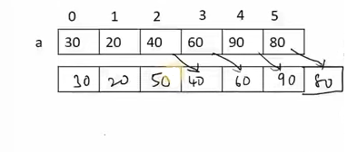
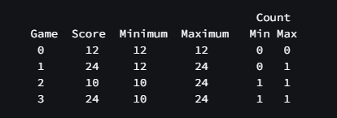
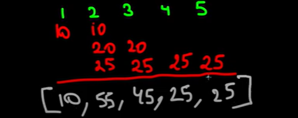
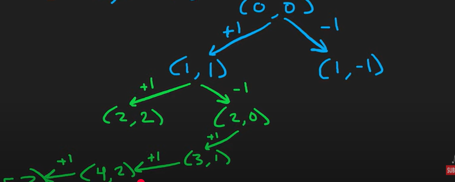

# Array & String

//Q1 in integer array move all 0's to the end of the array<br>
input: arr=[1,2,0,2,1,0]
output:arr=[1,2,2,1,0,0]<br>
//Q2 remove duplicate from sorted integer array<br>
input: arr=[1,2,0,2,1,0]
output:arr=[1,2,0]<br>
//Q3 rotate the array in k steps<br>
input: arr=[1,2,0,2,1,0],k=3
output:arr=[2,1,0,1,2,0]<br>
//Q4 find the missing number in an array<br>
input: arr=[0,1,2,3,5]
output:[4]<br>
//Q5 swap first and last character of a string or an array<br>
input: str="Test" arr=[5,17,11,10,12,6]
output:"tesT" or [6,17,11,10,12,5]<br>
//Q6 find the second(k) largest element in an array<br>
input: arr=[0,1,2,3,5]
output:[3]<br>
//Q7 reverse a string without affecting special character<br>
input: str='a,b$c'
output:'c,b$a'<br>
//Q8 reverse a number<br>
input: num=05 or -213
output:5 or -312<br>
//Q9 reverse each word in a sentence<br>
input: str='hello world'
output:'dlrow olleh'<br>
//Q10 find a triplet that sum to a given value in an array or 3 sum or sum od zeros<br>
input: arr=[-1,0,1,2,-1,-4],target=0
output:[-1,0,1] and [-1,-1,2]<br>
//Q11 find the number of occurrence in an array<br>
input: arr=[1,2,3,3,4,5,5],item=3
output:2<br>
//Q12 find the square of a sorted array<br>
input: arr=[1,3,-5,-6]
output:[1,9,25,36]<br>
//Q13 find first unique character in a string<br>
input: str='leetcode' or 'mymy'
output:0 or -1<br>
//Q14 find the product of a sorted array except self<br>
input: arr=[1,2,3,4]
output:[2*3*4,1*3*4,1*2*4,1*2*3]<br>
//Q15 check string is Anagram or not<br>
input: str1='listen' str2='silent'
output:yes<br>
//Q16 find middle value<br>
input: a=10,b=12,c=15
output:12<br>
//Q17 shuffle an array elements like [x1,y1,x2,y2,...xn,yn]<br>
input: arr=[2,5,1,3,4,7]
output:[2,3,5,4,1,7]<br>
//Q18 find common element from 3 sorted array<br>
input: a=[1,2,3,4,6],b=[1,2,3],c=[2,3,5,8]
output:[2,3]<br>
//Q19 find majority elements in an array<br>
input: arr=[1,2,2,6,6,6,6,7,10]
output:[6]<br>
//Q20 reverse 1st half of the elements in an array<br>
input: arr=[5,7,11,10,12,6]
output:[11,7,5,10,12,6]<br>
//Q21 check two array are equal or not<br>
input: arr1=[1,2,3] arr2=[1,2,3]
output:true<br>
//Q22 minimum number of swap required to sort the array<br>
input: arr=[4,3,2,1]
output:2<br>
//Q23 dividing a string in n equals part<br>
input: str='aaabbbccc',equalPart=3
output:abc<br>
//Q24 find longest common subpath<br>
input: str1='testing',str2='test'
output:test<br>
//Q25 check number is perfect square or not<br>
input: num=36,100
//Q26 square root of a number<br>
Input: n = 4 Output: 2
output:yes<br>
//Q26 how many capital and small letter in a string<br>
input: str='AbbaBaa12'
output:2 5<br>
//Q27 check weather a triangle is valid or not<br>
input: a1=9,a2=40,a3=41
output:valid 180<br>
//Q28 check weather a year is leap year or not<br>
input: year=2024
output:leap year<br>
//Q29 check weather a number is prime number or not<br>
input: n=7
output:prime<br>
//Q30 print all prime number between 1 to 10<br>
input: 1-10
output:prime<br>
//Q31 check whether number or string is palindrome or not (1,121,1221)<br>
//Q32 print fibonacci sequence f(n)=f(n-1)+f(n-2) where f(0)=0,f(1)=1<br>
//Q33 create a program related climbing stairs<br>
input: n = 3 output:3<br>
//Q34 check whether number is armstrong number or not<br>
1634=>1^4+6^4+3^4+4^4=1634<br>
//Q35 find HCF/GCD(Highest common factor) and LCM(Least common multiple)<br>
Input: a = 12, b = 18 output:hcf=6,lcm=36<br>
//Q36 check weather number is perfect or not<br>
6=>1+2+3,28=>1+2+4+7+14<br>
//Q37 find the longest common prefix among all the strings.<br>
example club,clao,clove=>cl<br>
//Q38 count number of vowels in a string<br>
//Q39 The task is to compute the average salary of the employees, excluding the minimum and maximum salary values<br>
//Q40 write a function to rotate the matrix by 90 degrees clockwise.<br>
//Q41 wap to check if the matrix is a lower triangular matrix<br>
input const matrix = [
[1, 0, 0],
[4, 5, 0],
[7, 8, 9]
];
output:true<br>
//Q42 find the maximum area of water a container can store<br>
Input: [4, 3, 2, 1, 4]
output:16<br>
//Q43 check balanced parentheses<br>
//Q44 Star Pattern 1<br>

```
<!-- *
     ***
     ***** -->
//Q44.1 Star Pattern 1.2<br>

<!--  #
     ##
    ###
   #### -->


//Q45 Star Pattern 2<br>

<!-- *****
     *   *
     *   *
     *   *
     ***** -->

//Q46 Star Pattern 3<br>

<!-- 4
     43
     432
     4321 -->

//Q47 Star Pattern 4<br>

<!-- 1
    123
   12345 -->

//Q48 Star Pattern 5<br>

<!-- *****
      ***
       * -->

//Q49 Star Pattern 6<br>

<!--   *
      **
     ***
      **
       *-->

//Q50 Star Pattern 7<br>

<!-- 1   1
     12 22
     12333 -->
```

//Q51 extract multiple whitespace from string<br>
//Q52 longest substring without repeating characters<br>
"abcabcbb" and "bbbb" ans is "abc" and "b"<br>
//Q53 find the maximum sum of the contiguous subarray.<br>
Input: [1, -2, 3, 4, -1, 2, 1, -5, 4]
output:10 [3, 4, -1, 2, 1]<br>
//Q54 find the sum of all numbers divisible by 2 and 3<br>
//Q55 implement merge sort<br>
input: [4, 2, 7, 1, 9, 3] output:[1, 2, 3, 4, 7, 9]<br>
//Q56 implement quick sort<br>
input:[3, 6, 8, 10, 1, 2, 1] output:[1, 1, 2, 3, 6, 8, 10]<br>
//Q57 flatten a nested array<br>
input: arr = [1, [2, [3, 4], 5], 6] output: [1, 2, 3, 4, 5, 6]<br>
//Q58 convert an array of objects to a single object:<br>
input: arr = [{id: 1, value: 10}, {id: 2, value: 20}, {id: 3, value: 30}]
output: {1: 10, 2: 20, 3: 30}<br>
/Q59 write a function to find all keys in an object with a specific value.<br>
input: obj = {a: 1, b: 2, c: 1}, value = 1
output: ['a', 'c']<br>
//Q60 merge two objects:<br>
input: obj1 = {a: 1, b: 2}, obj2 = {b: 3, c: 4}
output: {a: 1, b: 3, c: 4}<br>
//Q61 convert an object to an array of key-value pairs:<br>
input: obj = {a: 1, b: 2, c: 3} output: [['a', 1], ['b', 2], ['c', 3]]<br>
//Q62 find the intersection of two arrays:<br>
input: arr1 = [1, 2, 2, 1], arr2 = [2, 2] output: [2, 2]<br>
//Q63 update nested object property<br>
//Q64 remove Properties from an Object<br>
//Q65 check if Two Objects are Equal<br>
//Q66 check if Object is Empty<br>
//Q67 count Properties in an Object<br>
//Q68 basic understanding of curring and closure<br>
//Q69 create a utils functions of debouncing<br>
//Q70 create a utils functions of throttling<br>
//Q71 create a memorize functions<br>
//Q72 basic understanding of for of loop<br>
//Q73 create a polyfills of map method and forEach method<br>
//Q74 create a polyfills of filter method<br>
//Q75 Find the shortest string in array<br>
Input:['aaaa', 'aaaaaa', 'aaaaaaaa', 'aaa'] output 'aaa'<br>
//Q76 swap two number with or without using third variable<br>
Input: a=10,b=20 Output: a=20,b=10<br>
//Q77 create a simple breadcrumb using an array of object<br>
//Q78 Check If Two String Arrays are Equivalent <br>Input: word1 = ["ab", "c"], word2 = ["a", "bc"] Output: true "ab" + "c" === "a" + "bc" === "abc"<br>
//Q79 Rectangle Overlap<br>
Input: rec1 = [0,0,2,2], rec2 = [1,1,3,3] Output: true<br>
//Q80 Water and Jug Problem<br>
Input: x = 3, y = 5, target = 4 Output: true<br>
//Q81 find unique paths in a 2d grid<br>
Input: m = 3, n = 7 Output: 28<br>
//Q82 maximum amount of money you can rob from a row of houses, represented by an integer array nums, without robbing two adjacent houses<br>
Input: nums = [1,2,3,1] so output is 1+3=4<br>
//Q83 finding all possible paths in a 2D grid or rat in a maze(in 4 direction)<br>
//Q84 Sum of Array Elements and find max<br>
//Q85 reverse an array<br>
//Q86 Transpose of a Matrix<br>
//Q87 remove all even numbers<br>
//Q88 Convert UPPERCASE to lowercase<br>
//Q89 check rotated and sorted<br>
Input: nums = [3,4,5,1,2]
Output: true<br>
//Q90 binary to decimal<br>
//Q91 decimal to binary<br>
//Q92 Fahrenheit to Celsius<br>
//Q93 WAP to count total number of punctuation characters exist in a string<br>
//Q94 wap to count number of words present in a string<br>
//Q95 WAP to find distance between two points<br>
//Q96 wap all prime factor of given number<br>
//Q97 calculates the sum of the diagonal elements in 3\*3 matrix<br>
//Q98 count number of even and odd digit in a number<br>
//Q99 check given input character is alphabet or not<br>
//Q100 wap to swap two number<br>
//Q101 wap to check for Armstrong number(1,153,370)<br>
//Q102 wap to calculate simple internet<br>
//Q103 add an element at a given index<br>
<br>
//Q104 First Missing Positive<br>
//Q105 find all the leaders in the array<br>
Input: arr = [16, 17, 4, 3, 5, 2]
Output: [17, 5, 2]<br>
//Q106 find the Inversion Count in an array<br>
Input: arr[] = [2, 4, 1, 3, 5]
Output: 3
Explanation: The sequence 2, 4, 1, 3, 5 has three inversions (2, 1), (4, 1), (4, 3).<br>
//Q107 Count the number of nonzero digits in a given positive integer n that evenly divide n.<br>
Input: n = 2446
Output: 1<br>
Explanation: Here among 2, 4, 6 only 2 divides 2446 evenly while 4 and 6 do not.<br>
//Q108 find the minimum and maximum elements in the array.<br>
//Q109 Find the number of times a given sorted array has been right-rotated.<br>
Input: arr = [5, 1, 2, 3, 4]
Output: 1
Explanation: The given array is 5 1 2 3 4. The original sorted array is 1 2 3 4 5. We can see that the array was rotated 1 times to the right.<br>
//Q110 Rearrange a sorted array into a wave array in-place, ensuring the lexicographically smallest order.such that arr[1] >= arr[2] <= arr[3] >= arr[4] <= arr[5].....<br>
Input: arr[] = [1, 2, 3, 4, 5]
Output: [2, 1, 4, 3, 5]
Explanation: Array elements after sorting it in the waveform are 2, 1, 4, 3, 5.<br>
//Q111 Find the first repeating element in an array, returning its 1-based index.<br>
Input: arr[] = [1, 5, 3, 4, 3, 5, 6]
Output: 2
Explanation: 5 appears twice and its first appearance is at index 2 which is less than 3 whose first the occurring index is 3.<br>
//Q112 Two Sum - Pair with Given Sum<br>
Input: arr[] = [1, 4, 45, 6, 10, 8], target = 16
Output: true
Explanation: arr[3] + arr[4] = 6 + 10 = 16.<br>
//Q113 Maximum Sum of Distinct Subarrays With Length K<br>
Input: nums = [1,5,4,2,9,9,9], k = 3
Output: 15<br>
//Q114 Find the index of the largest element ≤ k floor in a sorted array; return -1 if none exists<br>
Input: arr[] = [1, 2, 8, 10, 11, 12, 19], k = 0
Output: -1
Explanation: No element less than 0 is found. So output is -1.<br>
//Q115 Find the missing and repeating numbers in an unsorted array of integers from the range [1, n]<br>
Input: arr[] = [2, 2]
Output: [2, 1]
Explanation: Repeating number is 2 and smallest positive missing number is 1.<br>
//Q116 Find the number of inversions in an array, where an inversion is a pair (i,j) such that arr[i]>arr[j] and i<j.<br>
Input: arr[] = [2, 4, 1, 3, 5]
Output: 3
Explanation: The sequence 2, 4, 1, 3, 5 has three inversions (2, 1), (4, 1), (4, 3).<br>
//Q117 Maximize the sum of an n×n matrix by flipping the signs of any two adjacent elements any number of times.<br>
Input: matrix = [[1,-1],[-1,1]]
Output: 4<br>
//Q118 Median of an Array <br>
Input: arr[] = [90, 100, 78, 89, 67]
Output: 89
Explanation: After sorting the array middle element is the median <br>
//Q119 Update each element in the array to its next smaller adjacent element; if none exists, set it to -1<br>
Input: arr[] = [4, 2, 1, 5, 3]
Output: [2, 1, -1, 3, -1]<br>
//Q120 Group anagrams from an array of strings while preserving their original order.<br>
Input: arr[] = ["act", "god", "cat", "dog", "tac"]
Output: [["act", "cat", "tac"], ["god", "dog"]]
Explanation: There are 2 groups of anagrams "god", "dog" make group 1. "act", "cat", "tac" make group 2.<br>
//Q121 Swap the k-th element from the start with the k-th element from the end in a 1-based indexed array.<br>
Input: arr[] = [1, 2, 3, 4, 5, 6, 7, 8], k = 3
Output: [1, 2, 6, 4, 5, 3, 7, 8]<br>
//Q122 Print Matrix in snake Pattern<br>
Input: N = 3, matrix[][] = [[45, 48, 54], [21, 89, 87], [70, 78, 15]]
Output: 45 48 54 87 89 21 70 78 15 <br>
//Q123 Count ways to N'th Stair(Order does not matter)<br>
Input: n = 4
Output: 3
Explanation: Three ways to reach at 4th stair. They are {1, 1, 1, 1}, {1, 1, 2}, {2, 2}.<br>
//Q124 GCD of Array<br>
Input: N = 3, arr[] = {2, 4, 6}
Output: 2
Explanation: GCD of 2,4,6 is 2.<br>
//Q125 Find the longest palindromic substring in a given string, preferring the smallest starting index in case of ties.<br>
Input: s = "aaaabbaa"
Output: aabbaa
Explanation: The longest palindrome string present in
the given string is "aabbaa".<br>
//Q126 Matrix Diagonal(primary+secondary) Sum<br>
Input: mat = [[1,2,3],
              [4,5,6],
              [7,8,9]]
Output: 25
Explanation: Diagonals sum: 1 + 5 + 9 + 3 + 7 = 25<br>
//Q127 Given a mxn matrix, count the number of squares in the matrix.<br>
Input:
m = 2, n = 2
Output:
5<br>
//Q128 Given a non null integer matrix Grid of dimensions NxM.Calculate the sum of its elements.<br>
Input:
N=2,M=3
Grid=
[[1,0,1],
[-8,9,-2]]
Output:
1<br>
//Q129 Check if the characters of string S can be rearranged to form a palindrome<br>
Input:
S = "geeksogeeks"
Output: Yes
Explanation: The string can be converted
into a palindrome: geeksoskeeg<br>
//Q130 Find the smallest number with the highest frequency in an array of numbers ranging from 0 to k-1.<br>
Input: k = 3, arr[] = [2, 2, 1, 2]
Output: 2
Explanation: 2 is the most frequent element.<br>
//Q131 Multiply two non-negative integers given as strings and return the product as a string without using built-in BigInteger or direct integer conversion<br>
Input: num1 = "2", num2 = "3"
Output: "6"<br>
//Q132 Find the first non-repeating character in a lowercase Latin string, or return '$' if none exists<br>
Input: s = "racecar"
Output: 'e'
Explanation: In the given string, 'e' is the only character in the string which does not repeat.<br>
//Q133 Roman to Integer<br>
Input: s = "III"
Output: 3
Explanation: III = 3.<br>
//Q134 Find the next lexicographically greater permutation of an integer array in-place using constant extra memory.<br>
Input: nums = [1,2,3]
Output: [1,3,2]<br>
//Q135 Find the total number of moves needed to transfer n disks in the Tower of Hanoi puzzle following the given rules<br>
Input: n = 2
Output: 3
Explanation: For n =2 , steps will be as follows in the example and total 3 steps will be taken.
move disk 1 from rod 1 to rod 2
move disk 2 from rod 1 to rod 3
move disk 1 from rod 2 to rod 3<br>
//Q136 Find the celebrity in an
n×n matrix where
mat[i][j]=1 means person
i knows person
j, or return -1 if no celebrity exists.<br>
Input: mat[][] = [[0 1 0], [0 0 0], [0 1 0]]
Output: 1
Explanation: 0th and 2nd person both know 1. Therefore, 1 is the celebrity.<br>
//Q137 Rearrange Array in Max Min Form
//Q138 At Least K Occurrences
//Q139 Alice and Bob each created one problem for coding round. A reviewer rates the two challenges, awarding points on a scale from 1 to 100 for three categories: problem clarity, originality, and difficulty.<br>
The rating for Alice's challenge is the triplet a = (a, a, a), and the rating for Bob's challenge is the triplet b = (b, b, b).
Your task is to compare these triplets.
For each category, if a[i] > b[i], Alice gets 1 point.
If b[i] > a[i], Bob gets 1 point.
If a[i] == b[i], neither Alice nor Bob gets a point.
Return the total points for Alice and Bob as an array [Alice's points, Bob's points]
a = [5, 6, 7]
b = [3, 6, 10]
output [1, 1]<br>
//Q140 Given a square matrix of size n x n, find the absolute difference between the sums of its two diagonals.<br>
n = 3
matrix = [
[11, 2, 4],
[4, 5, 6],
[10, 8, -12]
]
output:3<br>
//Q141 Convert a given time in numerals into words. The time is represented as hours and minutes.<br>
If the minutes are 0, use "o' clock."
If the minutes are between 1 and 30 (inclusive), use "minutes past."
If the minutes are greater than 30, use "minutes to" the next hour.
hour = 5
minute = 10
"ten minutes past five"<br>
//Q142 Given an array of integers, find the minimum sum and the maximum sum that can be obtained by adding all but one element of the array.<br>
arr=[1,2,5,7,9]
minimum sum=1+2+5+7
maximum sum=2+5+7+9<br>
//Q143 You are given a list of integers representing the heights of birthday candles on a cake. The child can only blow out the tallest candles. Your task is to count the number of tallest candles on the cake.
The first line contains an integer n, which is the number of candles on the cake.
The second line contains n space-separated integers representing the heights of the candles.
Return the number of tallest candles.<br>
4<br>
3 2 1 3<br>
2<br>
//Q144 Given a time in 12-hour AM/PM format, convert it to military (24-hour) time.<br>
07:05:45PM<br>
19:05:45<br>
//Q145 Two kangaroos start at positions x1 and x2 on a number line and jump distances v1 and v2, respectively. Determine if they will land on the same position at the same time.<br>
Example:
Input: x1 = 2, v1 = 3, x2 = 4, v2 = 2
Output: "YES" (They meet at position 8 after 3 jumps)<br>
//Q146 Find how many times Maria breaks her highest and lowest scoring records in a season.<br>
Input: [10, 5, 20, 20, 4, 5, 2, 25, 1]
Output: [2, 4]
Highest records broken: 20 → 25 (2 times)
Lowest records broken: 5 → 4 → 2 → 1 (4 times)<br>
<br>
//Q147 Given an array of bird observations, find the bird type that appears most frequently. If multiple bird types have the same frequency, return the smallest bird type ID<br>
Input: [1, 4, 4, 4, 5, 3]
Output: 4<br>
//Q148 Given an array of integers and a positive integer k, count the number of pairs (i, j) where i < j and the sum of arr[i] + arr[j] is divisible by k.<br>
Example
ar=[1,2,3,4,5,6]
k=5 3 pairs meet the criteria:[1,4],[2,3] and[4,6] <br>
//Q149 A student wants to reach page p in a book with n total pages by turning pages either from the front or the back. Each page turn flips two pages at a time. Find the minimum number of pages the student needs to turn.
considering each turn flips two pages.
n = 6, p = 5
output 1
From the front: (1 → 2), (3 → 4), (5 → 6) → 2 turns
From the back: (6 → 5) → 1 turn (minimum)
//Q150 Find the longest contiguous subarray where the absolute difference between any two elements is less than or equal to 1.<br>
a = [1,1,2,2,4,4,5,5,5]
5 (The longest subarray is [4,4,5,5,5])<br>
//Q151 Sort string based frequency of characters<br>
Input:
"tree"
Output"
"eert" or "eetr"<br>
//Q152 remove prime number from an array<br>
//Q153 remove vowel from string<br>
//Q154 reverse vowel of a string code<br>
//Q155 Given an array of hurdle heights and a character's maximum jump height, determine the minimum number of magic potion doses required to jump over all hurdles. Each dose increases the jump height by 1 unit. If the character can already clear all hurdles, return 0.<br>
k (maxJump)= 4  
height (hurdle)= [1, 6, 3, 5, 2]
2<br>
//Q156 A professor will cancel the class if fewer than k students arrive on time (arrival time ≤ 0). Given the arrival times of n students in array a, determine if the class is Cancelled or Not Cancelled<br>
n = 5, k = 3
a = [-2, -1, 0, 1, 2]
Output: No<br>
//Q157 Calculate the library fine based on return and due dates, where fines apply only for late returns: 15/day (same month), 500/month (same year), and 10,000 (next year).<br>
//Q158 Encrypt a given string by removing spaces and arranging characters in a grid with rows and columns based on its length. Read column-wise and return the encoded message.<br>
Example:
Input: "if man was meant to stay on the ground god would have given us roots"
Output: "imtgdvs fearwer mayoogo anouuio ntnnlvt wttddes aohghn sseoau"<br>
//Q159 You want to buy video games during a sale where the first game costs p dollars. Each subsequent game is d dollars cheaper until the price reaches m dollars, after which all games cost m. Given a budget s, determine how many games you can buy<br>
where p =initial game price,d=discount per game,m=minimum possible price,s=total budget
20 3 6 80<br>
6<br>
//Q160 A strange counter starts at t = 1 with an initial value of 3 and decreases by 1 each second until it reaches 1. At that point, it resets to twice the initial value of the previous cycle and continues. Given a time t, find the value displayed by the counter at that moment.<br>
input 4
output 6<br>
//Q161 Given a CamelCase string s, count the number of words it contains. The first word starts with a lowercase letter, and each subsequent word starts with an uppercase letter.<br>
Input:
oneTwoThree
Output:
3<br>
//Q162 Check if a given string contains "hackerrank" as a subsequence while maintaining character order.
For each query, print "YES" if the string contains "hackerrank," otherwise print "NO".<br>
input:
hereiamstackerrank
output:
yes<br>
//Q163 Given a string of 'A' and 'B', remove the minimum number of adjacent matching characters so that no two consecutive characters are the same<br>
input:
AAAA
AAABBB
output:
3
4<br>
//Q164 You are given N events, each with a unique start time, represented as [start_i, end_i]. For each event i, find the next event j with the smallest start time such that start_j ≥ end_i; if no such event exists, return -1<br>
//Q165 Alice, Bob, and Charlie participated in a 400-metre race, finishing in X, Y, and Z seconds respectively (X, Y, and Z are distinct).
Find the fastest runner.<br>
//Q166 you have X five-rupee coins and Y ten-rupee coins. If each chocolate costs Z rupees, find the maximum chocolates you can buy.<br>
//Q167 You are given a large number N. You need to print the number N+1.<br>
599->600
10000000000000000000->10000000000000000001<br>
//Q168 Convert String to Title Case<br>
GUYS, hello world->Guys, Hello World<br>
//Q169 Rearrange each row of a square grid alphabetically. Check if all columns are also in ascending order; return "YES" if true, otherwise return "NO"<br>
//Q170 Given a grid of size n x 3, find the number of ways to paint each cell using three colors (Red, Yellow, Green) such that no two adjacent cells (vertically or horizontally) share the same color. Return the result modulo 10^9 + 7.<br>

# hashing

//Q1 Check for Valid Anagram
//Q2 Check if Strings are Isomorphic
//Q3 Two Sum Problem
//Q4 You are given an integer array nums of length n, where nums contains numbers from 1 to n with exactly one duplicate and one missing number.
Write a function to return an array of two elements:
The first element is the number that occurs twice.
The second element is the missing number.<br>
Input: nums = [1, 2, 2, 4]
Output: [2, 3]<br>
//Q5 Given an array of integers nums and an integer k, find the number of unique pairs (nums[i], nums[j]) such that the absolute difference between the pair is equal to k and i != j.<br>
Input: nums = [3,1,4,1,5], k = 2
Output: 2(1,3),(3,5)<br>
//Q6 Given an array nums of n integers where nums[i] is in the range [1, n], return an array of all the integers in the range [1, n] that do not appear in nums.<br>
Input: nums = [4,3,2,7,8,2,3,1]
Output: [5,6]<br>
//Q7 Given a string s, find the first non-repeating character in it and return its index. If it does not exist, return -1.<br>
Input: s = "leetcode"
Output: 0<br>
//Q8 Given a pattern string and a sentence s consisting of words separated by spaces, write a function to determine if there is a one-to-one correspondence between each character in the pattern and each unique word in the sentence.<br>
Input: pattern = "abba", s = "dog cat cat dog"
Output: true<br>
//Q9 Design an LRUCache class that implements a Least Recently Used cache with get(key) and put(key, value) methods, where both operations run in O(1) time complexity. Use appropriate data structures to maintain the cache ordering.

Constraints:
The cache should have a fixed capacity and automatically evict the least recently used entry when the capacity is exceeded.
//Q10 hashing first repeating character<br>
//Q11 You are given two integer arrays, A and B, each of size n. A pair (i, j) is called beautiful if A[i] == B[j], and a beautiful set contains such pairs without index repetition.

Your task is to modify exactly one element in A to maximize the size of the pairwise disjoint beautiful set. Find and return this maximum size.<br>

# two pointer

//Q1 Given two strings s and t, return true if s is a subsequence of t, or false otherwise.<br>
Input: s = "abc", t = "ahbgdc"
Output: true<br>
//Q2 Remove Duplicates from Sorted Array<br>
Input: nums = [1,1,2]
Output: 2, nums = [1,2,_]<br>
//Q3 trapping rain water<br>
Input: height = [0,1,0,2,1,0,1,3,2,1,2,1]
Output: 6<br>
//Q4 Container With Most Water<br>
Input: height = [1,8,6,2,5,4,8,3,7]
Output: 49<br>
//Q5 Largest Rectangle in Histogram  
Input: heights = [2,1,5,6,2,3]
Output: 10<br>
<br>
//Q6 count the number of positive triangle<br>
Input: arr[] = [4, 6, 3, 7]
Output: 3<br>
//Q7 Segregate 0s and 1s in an array or move all even integer followed by all odd integer<br>
Input : [0, 1, 0, 1, 0, 0, 1, 1, 1, 0]
Output : [0, 0, 0, 0, 0, 1, 1, 1, 1, 1]<br>

# Linked List

//Q1 remove Node from linked List<br>
//Q2 detect a cycle in a linked list<br>
input: 1 -> 2 -> 3 -> 4 -> 5 -> 3
output:true<br>
//Q3 Find the Middle of a Linked List<br>
Input: 1 -> 2 -> 3 -> 4->5
output:3<br>
//Q4 delete Middle of Linked List<br>
Input: LinkedList: 1->2->3->4->5
Output: 1->2->4->5<br>
//Q5 You are given the head of a singly linked list. Your task is to reverse the linked list and return the new head of the reversed list<br>
Input: 1 -> 2 -> 3 -> 4 -> 5
Output: 5 -> 4 -> 3 -> 2 -> 1<br>
//Q6 find oddEven linked list<br>
input:1 -> 2 -> 3 -> 4 -> 5
Output: 1 -> 3 -> 5 -> 2 -> 4<br>
//Q7 merge two sorted linked list<br>
Input: list1 = [1, 2, 4], list2 = [3, 5, 6]
Output: [1, 2, 3, 4, 5, 6]<br>
//Q8 find nth node from the end of linked list<br>
//Q9 Insert Node at Head/Tail of Linked List<br>
//Q10 remove nth node from the end of linked list<br>
//Q11 Swap Nodes in Pairs in linked list<br>
Input: head = [1,2,3,4]
Output: [2,1,4,3]<br>
//Q12 find intersection node of two linked list using two pointer<br>
Input: intersectVal = 8, listA = [4,1,8,4,5], listB = [5,6,1,8,4,5], skipA = 2, skipB = 3
Output: Intersected at '8'<br>
//Q13 remove duplicate from a sorted linked list<br>
//Q14 merge two sorted linked list<br>
Input: list1 = [1,2,4], list2 = [1,3,4]
Output: [1,1,2,3,4,4]
//Q15 Sort a singly linked list using insertion sort and return its head
Input: head = [4,2,1,3]
Output: [1,2,3,4]<br>
//Q16 delete last element in linked list<br>
//Q17 Kth from End of Linked List<br>
//Q18 Delete without head pointer<br>
Input: Linked List = 1 -> 2, del_node = 1
Output: 2<br>
//Q19 Find the length of the loop in a linked list, or return 0 if no loop exists.<br>
Input: LinkedList: 25->14->19->33->10->21->39->90->58->45, c = 4
Output: 7
Explanation: The loop is from 33 to 45. So length of loop is 33->10->21->39-> 90->58->45 = 7.<br>
//Q20 Given the head of a linked list, return the list after sorting it in ascending order.<br>
Input: head = [4,2,1,3]
Output: [1,2,3,4]<br>
//Q21 Given the head of a linked list, rotate the list to the right by k places.<br>
Input: head = [1,2,3,4,5], k = 2
Output: [4,5,1,2,3]<br>
//Q22 reverse the doubly linked list and return its head<br>
Input: LinkedList: 3 <-> 4 <-> 5
Output: 5 <-> 4 <-> 3<br>
//Q23 Delete in a Doubly Linked List<br>
Input: LinkedList = 1 <--> 3 <--> 4, x = 3
Output: 1 <--> 3
Explanation: After deleting the node at position 3 (position starts from 1),the linked list will be now as 1 <--> 3.<br>
//Q24 Merge K sorted linked lists<br>
Input: arr[] = [1 -> 2 -> 3, 4 -> 5, 5 -> 6, 7 -> 8]
Output: 1 -> 2 -> 3 -> 4 -> 5 -> 5 -> 6 -> 7 -> 8<br>
//Q25 Binary Tree to DLL<br>
Input:
1
/ \
 3 2
Output:
3 1 2
2 1 3<br>
//Q26 Reverse a Doubly Linked List<br>
Input: LinkedList: 3 <-> 4 <-> 5
Output: 5 <-> 4 <-> 3<br>
//Q27 Flattening a Linked List<br>
//Q28 length of linked list<br>
//Q29 search k in linked list<br>

# heap

//Q1 Does array represent Heap<br>
n = 6
arr[] = {90, 15, 10, 7, 12, 2}
Output:
1<br>
//Q2 Efficiently match a given set of
n nuts and bolts using only nut-to-bolt comparisons, ensuring they follow the order { !,#,$,%,&,\*,?,@,^ }.<br>

# Sliding window

//Q1 Given an array of positive integers nums and a positive integer target, return the minimal length of a sub array
whose sum is greater than or equal to target. If there is no such subarray, return 0 instead.<br>
Input: target = 7, nums = [2,3,1,2,4,3]
Output: 2[4,3]<br>
//Q2 Find the longest contiguous subarray (baskets) containing at most two distinct integers (fruits).<br>
Input: fruits = [1,2,1]
Output: 3
Explanation: We can pick from all 3 trees.<br>
//Q3 Given an array of integers nums and an integer k. A continuous subarray is called nice if there are k odd numbers on it.<br>
Input: nums = [1,1,2,1,1], k = 3
Output: 2
Explanation: The only sub-arrays with 3 odd numbers are [1,1,2,1] and [1,2,1,1].<br>
//Q4 Find the first continuous subarray in a non-negative integer array arr[] whose sum equals target, and return its 1-based start and end indices; return [-1] if no such subarray exists.<br>
Input: arr[] = [1, 2, 3, 7, 5], target = 12
Output: [2, 4]
Explanation: The sum of elements from 2nd to 4th position is 12.<br>
//Q5 Longest Subarray with Sum K.<br>
//Q6 Max Sum Subarray of size K<br>
Input: arr[] = [100, 200, 300, 400] , k = 2
Output: 700
Explanation: arr3 + arr4 = 700, which is maximum.<br>
//Q7 Longest subarray with sum divisible by K<br>
Input: arr[] = [2, 7, 6, 1, 4, 5], k = 3
Output: 4
Explanation: The subarray [7, 6, 1, 4] has sum = 18, which is divisible by 3.<br>

# prefix sum

//Q0 print all subarrays of array
//Q1 print the sum of value in a array in given range(l=3 an r=5 follow 1 based index)<br>
a=[2,4,1,3,6,5]=1+3+6
1 2 3 4 5 6<br>
//Q2 subarray sum equals k<br>
Input: nums = [1,1,1], k = 2
Output: 2<br>
//Q3 subarry sum divisible by k<br>
Input: nums = [4,5,0,-2,-3,1], k = 5
Output: 7<br>
//Q4 Maximum Average Subarray<br> Input: nums = [1,12,-5,-6,50,3], k = 4
Output: 12.75000
Explanation: Maximum average is (12 - 5 - 6 + 50) / 4 = 51 / 4 = 12.75<br>
//Q5 find Maximum Subarray (Kadane’s Algorithm)<br>
Input: nums = [-2,1,-3,4,-1,2,1,-5,4]
Output: 6
Explanation: The subarray [4,-1,2,1] has the largest sum 6.<br>
//Q6 partition of the array into two subarray<br>
//Q7 product of array except self<br>
//Q8 Given n flights labeled 1 to n and an array bookings where each entry [firsti, lasti, seatsi] represents seatsi seats booked for flights firsti to lasti, return an array where each element represents the total seats reserved for the corresponding flight.<br>
Input: bookings = [[1,2,10],[2,3,20],[2,5,25]], n = 5
10 seats booked from flight 1 to 2.
Output: [10,55,45,25,25]<br>
<br>
//Q9 zero array transformation<br>
Input: nums = [1,0,1], queries = [[0,2]]
Output: true<br>
//Q10 maximum count of distinct integers you can select from the range while avoiding banned number and keeping the sum ≤ maxSum<br>
Input: banned = [1,6,5], n = 5, maxSum = 6
Output: 2<br>
//Q11 Find if there is a subarray with 0 sums<br>
Input: {4, 2, -3, 1, 6}
Output: true <br>

# binary search

//Q1 check weather a value is exist or not in array(recursion binary search)<br>
//Q2 search in 2D matrix<br>
Input: matrix = [[1,3,5,7],[10,11,16,20],[23,30,34,60]], target = 3
Output: true<br>
//Q3 Search in a Rotated Sorted Array with or without duplicate elements<br>
Note:we can not find the sorted segment like mid less end because it might be same number for mid and end in terms of duplicate
Input: nums = [2,5,6,0,0,1,2], target = 0
Output: true<br>
//Q4 Find Peak Element in a Mountain Array<br>
Input: nums = [1,2,3,1]
Output: 2<br>
Explanation: 3 is a peak element and your function should return the index number 2.<br>
//Q5 Find Minimum in Rotated Sorted Array
Input: nums = [3,4,5,1,2]
Output: 1<br>
Explanation: The original array was [1,2,3,4,5] rotated 3 times.<br>
//Q6 Spiral Matrix<br>
Input: matrix = [[1,2,3],[4,5,6],[7,8,9]]
Output: [1,2,3,6,9,8,7,4,5]<br>
//Q7 Find K Closest Elements ,Given a sorted array arr, and integers k and x, return the k closest integers to x in the array, sorted in ascending order, with ties broken by the smaller integer.<br>

# stack & queue

//Q1 sort a stack<br>
//Q2 reverse a stack<br>
//Q3 delete mid element of stack<br>
//Q4 remove consecutive subsequence<br> 1 2 2 3 4 4 ->1 2 3 4
//Q5 Palindrome Linked List <br>Input: head = [1,2,2,1] Output: true
//Q6 queue reversal<br>
//Q7 reverse 1st k element from queue<br>
//Q8 Time need to buy a tickets<br> Input: tickets:[5,1,1,1],k=0 Output: 8 [4,0,0,0] 4+1+1+1+1<br>
//Q9 remove invalid parenthesis and make it balanced by removing min number of bracket<br>
//Q10 next greater element <br>arr=[6,0,8,1,3] nge_arr=[8,8,-1,3,-1] like 6's next greater element 8 and 0's next greater element 8 and so on<br>
//Q11 next smaller element<br> arr=[4,8,5,2,2,5] nge_arr=[2,5,2,-1,-1]<br>
//Q12 Queue Using Two Stacks<br>
//Q13 Implement Stack using Queues<br>
//Q14 Implement Stack using Two Queues<br>
//Q15 remove all adjacent duplicate in string using stack<br>
Input: s = "abbaca" Output: "ca"<br>
//Q16 implement stack using array<br>
//Q17 Implement a stack using a linked list<br>
Input: [[1,2], [1,3], [2], [1,4], [2]]
Output: [3, 4]<br>
//Q18 Reverse First K elements of Queue <br>
Input:
5 3
1 2 3 4 5
Output:
3 2 1 4 5<br>
//Q19 Design Circular Queue<br>
//Q20 Queue using linked list<br>
//Q21 Given a string consisting of lowercase English letters, repeatedly remove adjacent pairs of matching letters until no such pairs remain. If the final string is empty, return "Empty String"<br>
Input:
aaabccddd
Output:
abd<br>

# searching & sorting

//Q1 bubble sort<br>
//Q2 selection sort<br>
//Q3 Insertion sort<br>
//Q4 Linear Search<br>
//Q5 implementing binary search in a sorted array(divide and conquer)
//Q6 find Overlapping Intervals<br>
Input: arr[][] = [[1,3],[2,4],[6,8],[9,10]]
Output: [[1,4], [6,8], [9,10]]
//Q7 Sort an array of 0s, 1s, and 2s<br>
//Q8 Merge Two Sorted Arrays Without Extra Space<br>
//Q9 Given an array where the first element is the pivot, partition it into three subarrays: left (elements < pivot), equal (elements = pivot), and right (elements > pivot). Return a new array with elements from left, equal, and right combined in order<br>
n = 5  
arr = [4, 5, 3, 7, 2]  
[3, 2, 4, 5, 7]<br>
//Q10 Given an array of item(toys) weights, find the minimum number of containers needed to ship them, where each container can hold items within 4 units of the lightest item inside.<br>

For w = [1, 2, 3, 21, 22, 23], the minimum number of containers required is 2 ([1, 2, 3] and [21, 22, 23]).<br>
//Q11 Find three stick lengths that form a non-degenerate triangle with the maximum perimeter. If multiple exist, choose the one with the longest maximum side, then the longest minimum side. If none exist, return [-1].<br>

# greedy algo

//Q1 min number of coins<br>
Input: coins[] = [25, 10, 5], sum = 30
Output: 2<br>
//Q2 Minimum Cost of Buying Candies With Discount<br>
Input: cost = [1,2,3]
Output: 5<br>
//Q3 Distribute Candies<br>
array candyType of length n (where n is always even), return the maximum number of different types of candies Alice can eat if she can only consume n / 2 candies.

Input: candyType = [1,1,2,2,3,3]
Output: 3<br>
//Q4 Non-overlapping Intervals<br>
Input: intervals = [[1,2],[2,3],[3,4],[1,3]]
Output: 1<br>
//Q5 Maximum Number of Balloons<br>
Input: text = "nlaebolko"
Output: 1<br>
//Q6 jump game<br>
each element in the array represents your maximum jump length at that position.
Return true if you can reach the last index, or false otherwise
Input: nums = [2,3,1,1,4]
Output: true
Explanation: Jump 1 step from index 0 to 1, then 3 steps to the last index.<br>
//Q7 Minimum Platforms Required for Given Arrival and Departure Times<br>
Input: arr[] = {9:00, 9:40, 9:50, 11:00, 15:00, 18:00}, dep[] = {9:10, 12:00, 11:20, 11:30, 19:00, 20:00}
Output: 3<br>
//Q8 merge overlapping intervals<br>
Input:arr[]=[[1,3],[2,4],[6,8],[9,10]]
Output:[[1,4],[6,8],[9,10]]<br>
//Q9 best time to sell stock and find max profit<br>
Input:prices[]={1,3,6,9,11} output:10<br>
//Q10 Find the starting gas station index to complete a circular route if possible; otherwise, return -1<br>
Input: gas = [1,2,3,4,5], cost = [3,4,5,1,2]
Output: 3<br>
//Q11 Find the minimum money required to complete all transactions in any order.<br>
Input: transactions = [[2,1],[5,0],[4,2]]
Output: 10<br>
//Q12 if an array can become non-decreasing by modifying at most one element<br>
Input: nums = [4,2,3]
Output: true
Explanation: You could modify the first 4 to 1 to get a non-decreasing array.<br>
//Q13 Find the minimum insertions needed to make a given parentheses string s valid.<br>
Input: s = "())"
Output: 1<br>
//Q14 Find the minimum number of jumps required to reach the last index of a non-negative integer array, where each element represents the maximum steps that can be jumped forward, or return -1 if unreachable.<br>
Input: arr[] = [1, 3, 5, 8, 9, 2, 6, 7, 6, 8, 9]
Output: 3
Explanation: First jump from 1st element to 2nd element with value 3. From here we jump to 5th element with value 9, and from here we will jump to the last.<br>
//Q15 Chocolate Distribution Problem<br>
//Q16 Meeting Rooms
//Q17 Given an array c of n clouds (0 = safe, 1 = thunderhead), find the minimum jumps needed to reach the last cloud, where you can jump 1 or 2 steps at a time<br>
n = 7  
c = [0, 0, 1, 0, 0, 1, 0] <br>
output=4<br>
//Q18 Given an array B where each element represents the number of loaves a person has, distribute the minimum number of loaves such that each person has an even count. You can only give a loaf to a person and their immediate neighbor at the same time. Return the minimum loaves distributed as a string or "NO" if it's impossible.<br>
N = 5  
B = [2, 3, 4, 5, 6]

output 4<br>

# Recursion

//Q1 Find the longest common subsequence(lcs) of two strings.<br>
Input: text1 = "abcde", text2 = "ace"
Output: 3<br>
//Q2 sort and reverse a stack using recursion<br>

# Dynamic Programming

//Q1 Count number of ways to cover a distance<br>
//Q2 Number of Dice Rolls With Target Sum<br>
//Q3 solve the word break problem<br>
//Q4 Unique Paths<br>
Input: m = 3, n = 7
Output: 28<br>
//Q5 Maximum Length of Repeated Subarray<br>
Input: nums1 = [1,2,3,2,1], nums2 = [3,2,1,4,7]
Output: 3
Explanation: The repeated subarray with maximum length is [3,2,1].<br>
//Q6 Find the minimum path sum from the top-left to the bottom-right of an m×n grid filled with non-negative numbers, moving only right or down<br>
Input: grid = [[1,3,1],[1,5,1],[4,2,1]]
Output: 7
Explanation: Because the path 1 → 3 → 1 → 1 → 1 minimizes the sum.<br>
//Q7 Target sum in array nums and an integer target, count the number of ways to assign + or - to each element in nums such that the resulting expression evaluates to target.<br>
<br>
//Q8 Longest Increasing Subsequence<br>
Input: nums = [10,9,2,5,3,7,101,18]
Output: 4
Explanation: The longest increasing subsequence is [2,3,7,101], therefore the length is 4.<br>
//Q9 Use backtracking with DFS to explore all possible paths, collecting the path with maximum gold while marking visited cells temporarily.<br>
Input: grid = [[0,6,0],[5,8,7],[0,9,0]]
Output: 24
Explanation:
[[0,6,0],
 [5,8,7],
 [0,9,0]]
Path to get the maximum gold, 9 -> 8 -> 7.<br>
//Q10 Maximum Product Subarray<br>
Input: nums = [2,3,-2,4]
Output: 6
Explanation: [2,3] has the largest product 6.<br>
//Q11 Palindromic Substrings<br>
Input: s = "abc"
Output: 3
Explanation: Three palindromic strings: "a", "b", "c".<br>
//Q12 Find the minimum number of coin change to make up the given amount using coins of different denominations, or return -1 if it's not possible.<br>
//Q13 print all the subsequence<br>
//Q14 Number of Subsequences That Satisfy the Given Sum Condition<br>
Input: nums = [3,5,6,7], target = 9
Output: 4<br>
//Q15 Kadane's Algorithm [find the maximum sum of a subarray.]<br>
Input: arr[] = [2, 3, -8, 7, -1, 2, 3]
Output: 11
Explanation: The subarray {7, -1, 2, 3} has the largest sum 11.<br>
//Q16 Longest Repeating Subsequence<br>
Input: s = "axxzxy"
Output: 2
Explanation: The given array with indexes looks like
a x x z x y
0 1 2 3 4 5<br>
//Q17 Find the maximum number of non-intersecting connecting lines between two integer arrays.<br>
Input: nums1 = [1,4,2], nums2 = [1,2,4]
Output: 2<br>
//Q18 Given a number n, find the minimum number of perfect squares (square of an integer) that sum up to n. <br>
Input: n = 100
Output: 1
Explanation: 10 (mul) 10 = 100

# tree

//Q1 Check if a tree is a BST or BT<br>
//Q2 find the lowest common ancestor (LCA) of two given nodes in the tree.<br>
//Q3 Level Order Traversal of Binary Tree<br>
//Q4 Preorder traversal in binary tree<br>
//Q5 Right/Left side View of Binary Tree<br>
//Q6 Merge Two Binary Trees<br>
Input: root1 = [1,3,2,5], root2 = [2,1,3,null,4,null,7]
Output: [3,4,5,5,4,null,7]<br>
//Q7 Sum of Left Leaves<br>
Input: root = [3,9,20,null,null,15,7]
Output: 9+15=24<br>
//Q8 Maximum or Minimum Depth in Binary Tree<br>
//Q9 check a tree is Balanced Binary Tree or AVL tree<br>
//Q10 Given the root of a binary tree, check whether it is a mirror(symmetric) of itself<br>
Input: root = [1,2,2,3,4,4,3] Output: true<br>
//Q11 Check it two trees are Identical(have the same value) or Not <br>
//Q12 Subtree of Another Tree<br>
//Q13 Count total Nodes in a complete Binary Tree<br>
//Q14 Invert/Flip Binary Tree<br>
Input: root = [4,2,7,1,3,6,9]
Output: [4,7,2,9,6,3,1]<br>
//Q15 whether a binary tree is a full binary tree or not<br>
//Q16 Recover BST <br>
Input: root = [1,3,null,null,2]
Output: [3,1,null,null,2]<br>
//Q17 Zig-Zag Level Order Traversal <br>
Input: root = [3,9,20,null,null,15,7]
Output: [[3],[20,9],[15,7]]<br>
<br>
//Q18 find height of binary tree<br>
//Q19 find diameter of binary tree<br>
Input: root = [1,2,3,4,5]
Output: 3
Explanation: 3 is the length of the path [4,2,1,3] or [5,2,1,3].<br>
//Q20 convert binary tree to mirror tree<br>
Input: root[] = [1, 2, 3, 4, 5]
Output: [1, 3, 2, N, N, 5, 4]<br>
//Q21 Minimum element in BST<br>
Input: root = [5, 4, 6, 3, N, N, 7, 1]
Output: 1<br>
//Q22 Insert a node in a BST<br>
Input: key = 4
Output: 1 2 3 4<br>
//Q23 k-th Smallest in BST<br>
Input: root = [2, 1, 3], k = 2
Output: 2<br>
//Q24 Top View of Binary Tree<br>
Input: root[] = [1, 2, 3]
Output: [2, 1, 3]<br>
//Q25 Check if a binary tree has a root-to-leaf path summing to targetSum<br>
Input: root = [5,4,8,11,null,13,4,7,2,null,null,null,1], targetSum = 22
Output: true<br>
//Q26 Find all root to leaf paths in a binary tree, prioritizing left subtree paths before right subtree paths.<br>
Input: root[] = [1, 2, 3, 4, 5]
Output: [[1, 2, 4], [1, 2, 5], [1, 3]]
Explanation: All possible paths: 1->2->4, 1->2->5 and 1->3<br>
//Q27 Check if two binary trees are isomorphic by allowing any number of left-right child swaps.<br>
Input: root1[] = [1, 2, 3, 4, 5, 7, 6, N, 7, 8], root2[] = [1, 3, 2, N, 6, 4, 5, 8, 7]
Output: true<br>
//Q28 Return the diagonal tree traversal of a binary tree as a single list, prioritizing left subtree elements before right when on the same diagonal.<br>
Input : root = [8, 3, 10, 1, 6, N, 14, N, N, 4, 7, 13]
Output : [8, 10, 14, 3, 6, 7, 13, 1, 4]<br>
//Q29 Array to BST<br>
Input: nums = [1, 2, 3, 4]
Output: true<br>
//Q30 Find and return all nodes at odd levels of a binary tree in sorted order.<br>
Input: root = [1, 2, 3, 4, 5, N, 6, N, N, 7, 8, 9]
Output: [1, 4, 5, 6]<br>
//Q31 find sum of tree<br>
//Q32 max of tree<br>

# graph

//Q1 Find if Path Exists in Graph using bfs<br> Input: n = 3, edges = [[0,1],[1,2],[2,0]], source = 0, destination = 2
Output: true<br>
//Q2 Check if all nodes of Undirected Graph can be visited from given Node using bfs<br>
//Q3 Number of Islands using dfs<br>
//Q4 Flood Fill Algorithm using dfs<br>
Input: image = [[1,1,1],[1,1,0],[1,0,1]], sr = 1, sc = 1, color = 2
Output: [[2,2,2],[2,2,0],[2,0,1]]<br>
//Q5 Max Area of Island<br>
Input: grid = [[0,0,0,0,0,0,0,0]]
Output: 0<br>
//Q6 Detect Cycle in a Directed Graph using DFS.<br>
//Q7 Print all paths from a given source to a destination/target<br>
Input: graph = [[1,2],[3],[3],[]]
Output: [[0,1,3],[0,2,3]]<br>
//Q8 clone graph<br>
Input: adjList = [[2,4],[1,3],[2,4],[1,3]]
Output: [[2,4],[1,3],[2,4],[1,3]]<br>
//Q9 Egg Drop With 2 Eggs and N Floors<br>
Input: n = 2
Output: 2<br>
//Q10 Find the minimum time required for all fresh oranges in an m x n grid to rot, where rotten oranges spread to adjacent fresh ones every minute, or return -1 if impossible.<br>
Input: grid = [[2,1,1],[1,1,0],[0,1,1]]
Output: 4<br>
//Q11 Find the minimum time for all n nodes in a directed network delay time (given as times[i] = (ui, vi, wi)) to receive a signal sent from node k, or return -1 if unreachable<br>
Input: times = [[2,1,1],[2,3,1],[3,4,1]], n = 4, k = 2
Output: 2<br>
//Q12 Find the minimum number of dice rolls required to reach the last square n×n snake and ladder board, where you move based on a 6-sided die and follow snakes or ladders when landed on.<br>
Input: board = [[-1,-1,-1,-1,-1,-1],[-1,-1,-1,-1,-1,-1],[-1,-1,-1,-1,-1,-1],[-1,35,-1,-1,13,-1],[-1,-1,-1,-1,-1,-1],[-1,15,-1,-1,-1,-1]]
Output: 4<br>
//Q13 Check if a given graph is Bipartite using DFS<br>
//Q14 Shortest path from 1 to n<br>
Input: n = 9
Output: 2<br>

# Bit manipulation

//Q1 count set bit ina integer<br>
Input: n = 2
Output: [0,1,1]
Explanation:
0 --> 0
1 --> 1
2 --> 10<br>
//Q2 find weather a number is power of two<br>Input: n = 16
Output: true
Explanation: 24 = 16
//Q3 find the single element in a non-empty array where every element appears twice except for one<br>
Input: nums = [2,2,1]
Output: 1
//Q4 Find the missing number in an array of size n−1 containing distinct integers from 1 to n<br>
//Q5 return count of set bits<br>
Input: n = 6
Output: 2
Explanation: Binary representation is '110', so the count of the set bit is 2.<br>
//Q6 Find the position of the only set bit in a number; return -1 if it has 0 or multiple set bits.<br>
Input: n = 2
Output: 2
Explanation: 2 is represented as "10" in Binary. As we see there's only one set bit and it's in position 2<br>
//Q7 Find the 1's complement of an N-bit binary number by inverting all its bits.<br>
Input:
N = 3
S = 101
Output:
010
Explanation:
We get the output by converting 1's in S
to 0 and 0s to 1<br>
//Q8 Find the total number of set bits in all numbers from 1 to N.<br>
Input: N = 3
Output: 4
Explaination:
1 -> 01, 2 -> 10 and 3 -> 11.
So total 4 setbits.<br>
//Q9 Find the sum of differing bits in binary representations for all ordered pairs
(Ai, Aj)in an array, modulo 10^9+7<br>
Input: N = 2
A = {2, 4}
Output: 4
Explaintion: We return
f(2, 2) + f(2, 4) +
f(4, 2) + f(4, 4) =
0 + 2 +
2 + 0 = 4.<br>
//Q10 Set the kth bit of
n (from the right) in its binary representation.<br>
Input: n = 10, k = 2
Output: 14<br>
//Q11 Division without using multiplication, division, and mod operator<br>
//Q12 Find the maximum XOR value between any two integers in the range [l, r].<br>
//Q13 Given a 32-bit unsigned integer , flip all its bits (convert 0 to 1 and 1 to 0) and return the result as an unsigned integer<br>
//Q14 Find count of numbers whose sum with n equals XOR with n<br>
5 <br>
2<br>
//Q15 Find the unique number in an array where all other elements appear twice<br>

# Backtracking

//Q1 generating all possible subsets (the power set) of a unique integer array<br>
Input: nums = [1,2,3]
Output: [[],[1],[2],[1,2],[3],[1,3],[2,3],[1,2,3]]<br>
//Q2 Given an array nums of distinct integers, return all the possible permutations<br>
Input: nums = [1,2,3]
Output: [[1,2,3],[1,3,2],[2,1,3],[2,3,1],[3,1,2],[3,2,1]]<br>
//Q3 Palindrome Partitioning<br>
Input: s = "aab"
Output: [["a","a","b"],["aa","b"]]<br>
//Q4 Partition Equal Subset Sum<br>
Input: nums = [1,5,11,5]
Output: true<br>
//Q5 generating all possible letter combinations for a phone number<br>
Input: digits = "23"
Output: ["ad","ae","af","bd","be","bf","cd","ce","cf"]<br>
//Q6 Given an n x n grid representing a knight's movement on a chessboard, return true if the knight visits every cell exactly once and follows valid knight moves, otherwise return false.<br>
Input: grid = [[0,11,16,5,20],[17,4,19,10,15],[12,1,8,21,6],[3,18,23,14,9],[24,13,2,7,22]]
Output: true
Explanation: The above diagram represents the grid. It can be shown that it is a valid configuration.<br>
//Q7 given 9x9 Sudoku board valid, ensuring each row, column, and 3x3 sub-box contains unique digits 1-9 in filled cells<br>
Input: board =
[["5","3",".",".","7",".",".",".","."]
,["6",".",".","1","9","5",".",".","."]
,[".","9","8",".",".",".",".","6","."]
,["8",".",".",".","6",".",".",".","3"]
,["4",".",".","8",".","3",".",".","1"]
,["7",".",".",".","2",".",".",".","6"]
,[".","6",".",".",".",".","2","8","."]
,[".",".",".","4","1","9",".",".","5"]
,[".",".",".",".","8",".",".","7","9"]]
Output: true<br>
//Q8 n queen problem

# Number Theory

//Q1 Find all pairs of prime numbers(x,y) with target sum such that 1≤x≤y≤n and x+y=n, returning a sorted 2D list or an empty array if no such pairs exist.<br>
Input: n = 10
Output: [[3,7],[5,5]]<br>
//Q2 return the number of common factors of a and b<br>
Input: a = 12, b = 6
Output: 4
Explanation: The common factors of 12 and 6 are 1, 2, 3, 6<br>
//Q3 Check if an integer n has exactly three positive divisors<br>
Input: n = 4
Output: true
Explantion: 4 has three divisors: 1, 2, and 4.<br>
//Q4 Find the kth smallest factor of a given integer n, or return -1 if n has fewer than k factors.<br>
Input: n = 12, k = 3
Output: 3
Explanation: Factors list is [1, 2, 3, 4, 6, 12], the 3rd factor is 3.<br>
//Q5 Given an integer num, repeatedly sum its digits until a single-digit result is obtained, and return it.<br>
Input: num = 38
Output: 2
Explanation: The process is
38 --> 3 + 8 --> 11
11 --> 1 + 1 --> 2
Since 2 has only one digit, return it.<br>
//Q6 In a circular jail with n prisoners, m sweets are distributed starting from prisoner s. Each prisoner gets one sweet in order until all are given out. The last sweet is poisoned. Find the prisoner who gets it.<br>
n = 5, m = 2, s = 1
output 2<br>
//Q7 Given n piles of chips and a maximum add limit k, two players take turns either adding or removing chips from a single pile. The player who removes the last chip wins. Determine whether the first or second player wins if both play optimally.<br>
//Q8 Given n towers of height m, two players take turns reducing a tower's height to any divisor of its current height (except itself). If a player cannot move, they lose. Determine if the first player (1) wins or the second player (2) wins.<br>

# Achievement


