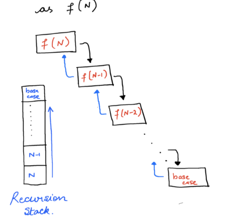

# Recursion

when a function calls itself until a specific condition met is called recursion
application of recursion and backtracking is render tree solving puzzle game
Recursive solutions work as a a basis for Dynamic Programming and Divide and Conquer algorithms
its a approach that allows us to shorten our code it must have a base case and recursive case

```
methodName(n parameters){
if(haltCondition){
return result
}
return methodName(n parameters)
}
```


concept of Function Call Stack and stack Frame in recursive function

# Dynamic Program

is mainly an optimization over plain recursion. Wherever we see a recursive solution that has repeated calls for the same inputs, we can optimize it using Dynamic Programming.
application of dp is optimize and memorize rendering,overlapping subproblem
problem related to choice mainly related to recursion and in recursion if there are overlapping problem and max/min related problem are there there use dynamic problem
// fun(3)
// |
// fun2 (fun1)
// |
// (fun1) fun0
approaches:

//print 1st n natural number

```
function print(c,n){
if(c===n)return
else {
console.log('sam',c)
print(c+1,n)
}
}
print(1,5)
```

//print sum of 1st n natural number
function print(c,n,s){
if(c===n){
console.log(s)
return}
else {
s+=c
print(c+1,n,s)
}
}
print(1,5,0)
//print sum of 1st n natural number with alternate signs
1-2+3-4+5=3
function seriesSum(n){
if(n===0)return 0
if(n%2===0) return seriesSum(n-1)-n
else return seriesSum(n-1)+n
}

//find gcd of two number
function gcd(x,y){
if(y==0)return x;
return gcd(y,x%y)
}

//find sum of digit using recursion
function sod(n){
if(n>=0&&n<=9){
return n
}
return sod(n/10)+n%10
}

//factorial of n
logic: n!=n (n-1) (n-2)...1 =>fact(5)=5\*fact(4)

function fact(n){
if(n===0)return 1
else return n * fact(n-1)
}
console.log(fact(5))
//find nth fibonacci number
0 1 1 2 3 5
function nthFibo(n){
if(n==0||n==1)return n
return nthFibo(n-1)+nthFibo(n-2)
}
//Power Of Numbers Pow(x, n)
//logic n^p=5^3=5*pow(5,2)
var myPow = function (x, n) {
if (x === 0) return 0;//0^0=0
if (n === 0) return 1//0^1=1
if (n === 1) return x
//make negative power positive
if (n < 0) {
x = 1 / x
n = -n
}

    if (n % 2 !== 0) return x * myPow(x, n - 1)

    return myPow(x * x, n / 2)

};
//print array value recursively and find max number
function printArray(arr,i){
if(i===arr.length)return
console.log(arr[i])
let small=printArray(arr,i+1)
return Math.max(arr[i],small)
}
//sum of array elements
function sum(arr,i){
if(i===0)return 0
return arr[i-1]+sum(arr,i-1)

}
const arr=[1,2,3,4,5]
const res=sum(arr,arr.length-1)
console.log(res)

//largest element in array
function largest(arr,i){
if(i===1)return arr[0]
return Math.max(largest(arr,i-1),arr[i-1])
}
const arr=[1,2,3,4,5]
const res=largest(arr,arr.length)
console.log(res)

//reverse an array
function swap(arr,i,j){
const temp = arr[i];
arr[i] = arr[j];
arr[j] = temp;
}
function reverseArr(l,r,arr){
if(l>=r)return
swap(arr,l,r)
reverseArr(l+1,r-1,arr)

}
const arr=[1,2,3,4,5]
reverseArr(0,arr.length-1,arr)
console.log(arr)

//find linear search using recursion
function search(arr,n,target,i){
if(i>=n) return false
if(arr[i]===target) return true
return search(arr,n,target,i+1)
}

//remove all the occurence of a from the string "abcax"
//f(s,5)->'',f(s,4)=>'x',f(s,3)=>"cx",f(s,2)=>"cx",f(s,1)=>bcx,f(s,0) return bcx
function removeA(s,i){
if(i==s.length) return '';
let small=removeA(s,i+1)
let curr=s.charAt(i);
if(curr!=='a') return curr+small
}
