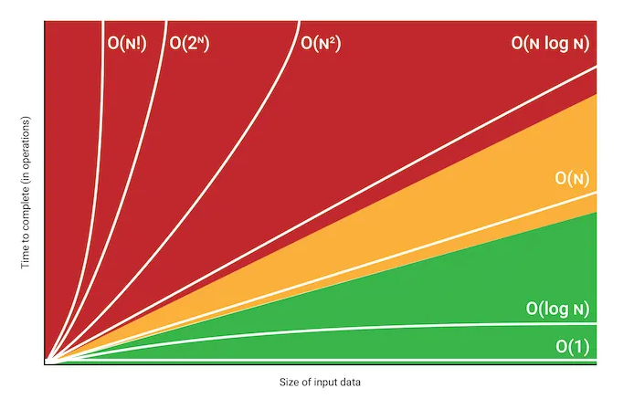

# Time Complexity

Time complexity is the amount of time taken by an algorithm as a function of the input size (n). It helps us understand how the runtime of an algorithm grows as the input size increases.



### Big O Notation

Big O Notation gives the worst-case complexity of an algorithm. It describes the upper bound of the growth rate of the algorithm's runtime.

### Common Time Complexities

1. **O(1) - Constant Time**

   - Example: `console.log("Hello World")`
   - Operations that always take the same amount of time, regardless of input size.

2. **O(n) - Linear Time**
   - Example:
     ```javascript
     for (i = 1; i <= n; i++) {
       statement1;
       statement2;
     }
     ```
3. **O(log n) - Logarithmic Time**

   - Example:

   ```javascript
   for (i = 1; i <= n; i *= 2) {
     statement1;
     statement2;
   }
   ```

   - Example: Common in binary search or balanced binary search trees (BST)

4. **O(n log n) - Time**

   - Example:
     -Merge Sort
     -Quick Sort

   ```javascript
   function mergeSort(arr) {
     if (arr.length <= 1) return arr;

     const mid = Math.floor(arr.length / 2);
     const left = mergeSort(arr.slice(0, mid));
     const right = mergeSort(arr.slice(mid));

     return merge(left, right);
   }
   ```

- Example: Common in binary search or balanced binary search trees (BST)

5. **O(n^2) - Quadratic Time**

- Example:

  ```javascript
  let count = 0;
  for (let i = N; i > 0; i /= 2) {
    for (let j = 0; j < i; j++) {
      statement1;
    }
  }
  ```

6. **O(n^3) - Cubic Time**

   ```javascript
   for (let i = 0; i < n; i++) {
     for (let j = 0; j < n; j++) {
       for (let k = 0; k < n; k++) {
         statement1;
       }
     }
   }
   ```

7. **O(2^n) - Exponential Time**

   ```javascript
   function fibonacci(n) {
     if (n <= 1) return n;
     return fibonacci(n - 1) + fibonacci(n - 2);
   }
   ```

8. **O(n!)**
   -Example

### Simplifying Time Complexity

When analyzing time complexity:

1. Ignore constants
2. Consider only the largest term

For example, if f(n) = 2n^2 + 5n + 9, the time complexity is O(n^2).

### Constraints and Acceptable Time Complexities

Based on common constraints in competitive programming:

- n ≤ 10^8: O(n) is acceptable
- n ≤ 10^6: O(n log n) is acceptable
- n ≤ 10^4: O(n^2) is acceptable
- n ≤ 500: O(n^3) is acceptable
