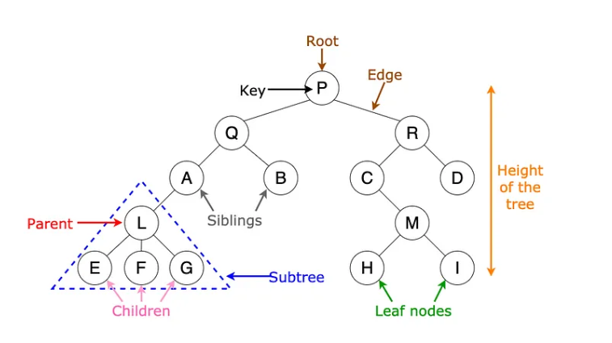

# Tree

// A tree is a non-linear hierarchical data structure consisting of nodes linked together to simulate a hierarchy.<br>
// If a tree has N nodes, there are exactly N-1 edges.<br>
 <br>
// Tree Terminology:<br>
// Root node: The topmost node in a tree.<br>
// Parent node: The immediate predecessor of a node.<br>
// Child node: The immediate successor of a node.<br>
// Leaf node: A node that has no child.<br>
// Non-leaf node: A node that has at least one child.<br>
// Sibling: Nodes that share the same parent.<br>
// Degree of a node: The number of children a node has.<br>
// Depth of a node: The length of the path from the root to the node.<br>
// Height of a node: The number of edges on the longest path from the node to a leaf.<br>
// Path: A collection of edges from the source node to the destination node.<br>
// Subtree: A portion of a tree consisting of a node and its descendants. A tree can have left and right subtrees.<br>
// Diameter: The longest path between any two nodes in the tree, measured in the number of edges.<br>
// Right view: Nodes visible when the tree is viewed from the right.<br>
// Top view: Nodes visible when the tree is viewed from the top.<br>

// Applications of Trees:<br>
// - Expression evaluation.
// - Directory structure management.
// - Database indexing.

// Binary Tree:<br>
// A binary tree is a tree where each node has at most two children, referred to as the left child and the right child.
// Types:<br>
// 1. Strict binary tree: A binary tree where each node has either 0 or 2 children.<br>
// 2. Complete binary tree: All levels except possibly the last are completely filled, and the last level has nodes as left as possible.<br>
// 3. Perfect binary tree: A binary tree where all internal nodes have two children, and all leaf nodes are on the same level.<br>
// 4. Full binary tree: Every node other than the leaves has two children.<br>
// 5. Balanced binary tree: The height difference between the left and right subtrees of every node is at most 1.<br>

// Binary Tree Node Structure in JavaScript:

```
class TreeNode {
constructor(data) {
this.data = data;
this.left = null;
this.right = null;
}
}

let root = new TreeNode(1);
root.left = new TreeNode(2);
root.right = new TreeNode(3);
root.left.left = new TreeNode(4);
root.left.right = new TreeNode(5);

function insert(data) {
root = insertRec(root, data);
}

function insertRec(root, data) {
if (root === null) {
return new TreeNode(data);
}
if (data < root.data) {
root.left = insertRec(root.left, data);
} else if (data > root.data) {
root.right = insertRec(root.right, data);
}
// If data is equal to root.data, we don't insert (assuming no duplicates)
return root;
}
```

// Preorder Traversal: Root -> Left -> Right (Output: 1, 2, 4, 5, 3)

```
function preorder(root) {
if (!root) return;
console.log(root.data);
preorder(root.left);
preorder(root.right);
}
```

// Inorder Traversal: Left -> Root -> Right (Output: 4, 2, 5, 1, 3)

```
function inorder(root) {
if (!root) return;
inorder(root.left);
console.log(root.data);
inorder(root.right);
}
```

// Postorder Traversal: Left -> Right -> Root (Output: 4, 5, 2, 3, 1)

```
function postorder(root) {
if (!root) return;
postorder(root.left);
postorder(root.right);
console.log(root.data);
}
```

// Binary Search Tree (BST):
// A BST is a binary tree where:
// - The left subtree contains nodes with values less than the parent node.
// - The right subtree contains nodes with values greater than the parent node.

// AVL Tree:
// A self-balancing binary search tree where the balance factor
// (height of left subtree - height of right subtree) must be in the range {-1, 0, 1}.

// Heap Tree:
// A complete binary tree where:
// - Min-Heap: The root node is the smallest element, and every parent is smaller than its children.
// - Max-Heap: The root node is the largest element, and every parent is larger than its children.
